#### **UNITY FOR GAMES E-BOOK**


# U N I T Y G A M E D E V FIELD GUIDE


**2020 LTS EDITION**

| First steps 5                              |
|--------------------------------------------|
| Key feature overview 6                     |
| Visual Editor 6                            |
| Component-based architecture 6             |
| C# 6                                       |
| Prefab workflow 6                          |
| Unity Hub 6                                |
| Render pipelines 7                         |
| Multiplatform development 7                |
| Packages and extensibility 7               |
| Worldbuilding 8                            |
| Active community 8                         |
| Unity Hub 9                                |
| Sample projects 11                         |
| Learn projects 11                          |
| Unity Asset Store assets 13                |
| Unity GitHub repository 13                 |
| Editor interface 15                        |
| The main windows 15                        |
| Editor Play mode 17                        |
| Version control 18                         |
| Plastic SCM 19                             |
| Git 20                                     |
| Perforce 21                                |
| Project organization 22                    |
| The Project view 22                        |
| Folder structure and naming 25             |
| Scenes 25                                  |
| The Hierarchy window 27                    |
| General tips for scenes and hierarchies 27 |
| Naming standards 28                        |
|                                            |

| GameObjects and components 29                       |
|-----------------------------------------------------|
| The Inspector 30                                    |
| The Transform component 31                          |
| Tips for working with transforms 31                 |
| Built-in components 32                              |
| Custom components 33                                |
| Prefabs 34                                          |
| Prefab usage 34                                     |
| Creating Prefab assets and instances 34             |
| Prefab mode 35                                      |
| Prefab Variants and Nested Prefabs 36               |
| Package Manager 37                                  |
| Programming 38                                      |
| Custom components and Monobehaviours 38             |
| Initializing objects 39                             |
| Monobehaviour lifecycle and structure 40            |
| More scripting tips 42                              |
| Common classes 43                                   |
| Memory management 44                                |
| Value versus reference types 44                     |
| Garbage collection 44                               |
| Multithreading: C# Job System and Burst compiler 46 |
| Scripting backends in Unity 47                      |
| Editor scripting 47                                 |
| Odin Inspector and Serializer 48                    |
| Integrated development environment (IDE) support 50 |
| Script templates 50                                 |
| Building and publishing 51                          |
| Device Simulator 53                                 |
| Input 54                                            |
| Input System 54                                     |
| Built-in Input class 54                             |
| User interface 56                                   |
| Unity GUI 56                                        |
| Immediate Mode GUI 57                               |

| Profiling and optimization 58    |
|----------------------------------|
| Unity Profiler 58                |
| Memory Profiler 59               |
| Profile Analyzer 60              |
| Debugging and playtesting 61     |
| Debugging gameplay 61            |
| Additional debugging tips 62     |
| Unity Test Framework 63          |
| Particle effects 64              |
| Physics 66                       |
| 3D physics 66                    |
| 2D physics68                     |
| Audio 69                         |
| Render pipelines and graphics 70 |
| 3D pipelines 70                  |
| 2D pipeline 73                   |
| Worldbuilding 74                 |
| ProBuilder and Polybrush 74      |
| Terrain tools 74                 |
| 2D Tilemap and Sprite Shape 75   |
| Unity Asset Store 76             |
| Importing an asset 76            |
| Become a publisher 76            |
| Learning resources 77            |
| Documentation 77                 |
| Unity Learn 77                   |
| Unity Blog 77                    |
| Professional training 77         |
| Next steps 78                    |

### <span id="page-4-0"></span>**First steps**

Shipping a game on a new platform and engine may seem like a journey of a thousand miles, but, like all worthwhile pursuits, it begins with a single step. And like every other journey, it helps to have a map to guide you.

As an industry veteran, you've faced the kinds of obstacles we'll cover here before: design and planning, development and testing, then launch and maintenance.

We've created this guide for experienced developers making the transition to Unity or returning from a long hiatus. Whether you're a solo indie developer or an established game studio, the Unity core platform can do the heavy lifting for you. This lets you focus on what you do best: building immersive and interactive real-time experiences.

Unity is better than ever, and we'd like to invite you to discover a host of new features, designed to make game development faster, more efficient, and more fun than ever before.

Over 1.5 million monthly active creators choose Unity to make amazing [games](https://unity.com/madewith?utm_source=demand-gen&utm_medium=pdf&utm_campaign=asset-links-gmg-choose-unity-for-multiplatform&utm_content=game-dev-field-guide-ebook) and publish them to a wide range of [devices](https://unity.com/features/multiplatform?utm_source=demand-gen&utm_medium=pdf&utm_campaign=asset-links-gmg-choose-unity-for-multiplatform&utm_content=game-dev-field-guide-ebook). Our highly extensible platform brings artists, designers, and developers together.

This guide will help you jump-start your familiarity with Unity's rich feature set and intuitive workflows. Whether you're developing an action RPG for PC and console or the latest physics puzzler for mobile, Unity is here to help.

### <span id="page-5-0"></span>**Key feature overview**

#### **Visual Editor**

The Unity Editor includes a comprehensive interface that will help you iterate rapidly through cycles of prototyping and testing to quickly transform your proof of concept into a working build.

#### <span id="page-5-1"></span>**Component-based architecture**

Everything in a Unity Scene is a **GameObject**. You'll combine these with **components**, modular and reusable parts that you can mix and match for functionality. A camera in Unity is simply a GameObject with a Camera Component. A light is a GameObject with a Light Component. This componentbased system is simple, flexible, and highly scalable.

#### <span id="page-5-2"></span>**C#**

Unity uses C#, an industry standard and one of the most widely used programming languages in the world. C# is an object-oriented and type-safe language with an extensive community and enterprise support.

If you're already familiar with C-based languages or Java, you'll have a low learning curve to get started in Unity scripting. If the Unity Editor doesn't fit your project requirements out-of-the-box, you can write your own scripted components that will work seamlessly with their built-in counterparts.

Unity includes support for a number of IDEs, including Visual Studio, VS Code, and JetBrains Rider. See [Integrated development environment \(IDE\) support](#page-49-2)  below for details.

#### <span id="page-5-3"></span>**Prefab workflow**

Don't build something twice if you can build it once and reuse it – this will save you time and get better runtime performance. With **Prefabs**, you can set up GameObjects as assets in a library, then instance them at runtime. This workflow includes Variants, where you can "subclass" and override part of your "template" Prefab. You can also build complex Nested Prefabs out of smaller Prefabs, enabling you to propagate changes into your scene as soon as you make them.

#### <span id="page-5-4"></span>**Unity Hub**

The [Unity Hub](https://docs.unity3d.com/Manual/GettingStartedInstallingHub.html) is a front-end application that helps you install Unity and manage your engine versions, licensing, and projects. It ties your projects to specific versions of Unity, so that an engine update won't impede production or create local conflicts. The Hub also gives you easy access to valuable training materials and a vibrant Unity community.

#### <span id="page-6-0"></span>**Render pipelines**

In Unity, you can choose between different prebuilt render pipelines to help you draw your graphics onscreen. The **[Universal Render Pipeline \(URP\)](https://docs.unity3d.com/Packages/com.unity.render-pipelines.universal@11.0/manual/?utm_source=demand-gen&utm_medium=pdf&utm_campaign=asset-links-gmg-choose-unity-for-multiplatform&utm_content=game-dev-field-guide-ebook)** focuses on wide platform compatibility and maximum performance, while the **[High Definition Render Pipeline \(HDRP\)](https://docs.unity3d.com/Packages/com.unity.render-pipelines.high-definition@11.0/manual/index.html?utm_source=demand-gen&utm_medium=pdf&utm_campaign=asset-links-gmg-choose-unity-for-multiplatform&utm_content=game-dev-field-guide-ebook)** adds high-fidelity visuals for PCs and consoles. You can also create shaders either with HLSL or using the nodebased **[Shader Graph](https://unity.com/shader-graph)** tool, which doesn't require coding.


The HDRP is designed to create high-fidelity visuals.

#### <span id="page-6-1"></span>**Multiplatform development**

Unity is guided by the ideal of helping developers build once, deploy anywhere. Our goal is to help your work reach the widest possible audience as you evolve your IP with the industry. We've enabled thousands of studios to achieve this, including Unknown Worlds, creators of the *Subnautica* series.

After developing your content in the Editor, you can deploy it across over 20 platforms, including PlayStation, Xbox, Nintendo Switch, PC, and mobile. With Unity, you can even create builds for WebGL and XR platforms like Oculus Quest.

#### <span id="page-6-2"></span>**Packages and extensibility**

The **[Package Manager](https://learn.unity.com/tutorial/the-package-manager)** offers the ability to discover and update features independently of the Editor. Unity maintains a content repository of packages that extend its core functionality.

Keep your project lean and only import what you need. Packages allow you to explore Preview or Experimental features before they become production-ready, so you can plan ahead for new technologies that you might want to incorporate into future projects.

#### <span id="page-7-0"></span>**Worldbuilding**

Unity includes a suite of tools for constructing environments. **[ProBuilder](https://unity.com/features/probuilder)**, a unique hybrid of 3D modeling and level-design tools, lets you model simple geometry and whitebox your game levels.

If you're working in **[2D](https://unity.com/features/2dtools)**, Unity includes tools such as SpriteShape and Tilemap to help you layout your 2D environments. Environment artists can generate natural landscapes using terrains, which you can paint using the included brush tools.


ProBuilder helps you prototype your levels.

#### <span id="page-7-1"></span>**Active community**

Unity has a broad reach and active user base. Developers used the Unity core platform to create and monetize over half of the top 1,000 mobile games on the Apple App Store and Google Play. With over a million active monthly creators, you can tap into an extensive knowledge base about development issues on the official [Unity forums](https://forum.unity.com/) and other online communities.

## <span id="page-8-0"></span>**Unity Hub**

Begin exploring Unity with the [Unity Hub](https://docs.unity3d.com/Manual/GettingStartedInstallingHub.html), a tool that manages all of your Unity projects and installations. Use the Hub to install one or more versions of the Unity Editor, create new projects, or open existing ones.

To get the Hub, visit the [Unity website](https://unity.com/download?utm_source=demand-gen&utm_medium=pdf&utm_campaign=asset-links-gmg-choose-unity-for-multiplatform&utm_content=game-dev-field-guide-ebook) and select **[Download Hub](https://public-cdn.cloud.unity3d.com/hub/prod/UnityHubSetup.dmg?_gl=1*7j32sd*_gcl_aw*R0NMLjE2MjQzNzAzMTAuQ2owS0NRandsTWFHQmhEM0FSSXNBUHZXZDZnWTBTN2pmblZ3NkxNSGt2UFk1ZHduZzBJMWo1M3VrZDJ6NUd6Q0tMTWZmTG5SRlRJc2s2QWFBdFhWRUFMd193Y0I.*_ga*NDQyOTg1NDQyLjE2MjE3ODU4MzU.*_ga_1S78EFL1W5*MTYyNDkwMDIyMC4xODcuMS4xNjI0OTAwMjMyLjQ4&_ga=2.185960480.804962837.1623445685-442985442.1621785835&_gac=1.158218824.1624370310.Cj0KCQjwlMaGBhD3ARIsAPvWd6gY0S7jfnVw6LMHkvPY5dwng0I1j53ukd2z5GzCKLMffLnRFTIsk6AaAtXVEALw_wcB)**. Use the interface to install Unity, and activate an [individual or team license](https://store.unity.com/#plans-individual?utm_source=demand-gen&utm_medium=pdf&utm_campaign=asset-links-gmg-choose-unity-for-multiplatform&utm_content=game-dev-field-guide-ebook) before launching the engine. [Unity Plus and Pro](https://store.unity.com/compare-plans) licenses also require a valid serial number.

| ●●<br>C<br>0<br>WL                             | Installs                                                                                           | Install Editor<br>Locate |
|------------------------------------------------|----------------------------------------------------------------------------------------------------|--------------------------|
| 0<br>Projects                                  | All<br>Official releases<br>Pre-releases                                                           | Q Search                 |
| 0<br>Installs<br>6<br>Learn<br>of<br>Community | 2021.1.2f1<br>4<br>/Applications/Unity/Hub/Editor/2021.1.2f1/Unity.app<br>Windows<br>macOS         | 0                        |
| 14<br>Downloads                                | 2020.3.13f1 LTS<br>4<br>/Applications/Unity/Hub/Editor/2020.3.13f1/Unity.app<br>macOS<br>Windows   | 0                        |
|                                                | 2020.3.12f1 LTS<br>દ્ધ<br>/Applications/Unity/Hub/Editor/2020.3.12f1/Unity.app<br>macOS<br>Windows | 0                        |
|                                                | 2019.4.28f1 LTS<br>4<br>/Applications/Unity/Hub/Editor/2019.4.28f1/Unity.app<br>Windows<br>macOS   | 0                        |
| Switch channel<br>3.0.0-beta.1                 |                                                                                                    |                          |

The Unity Hub helps you manage projects and installed versions.

In the Unity Hub, navigate through the Projects, Installs, Learn, and Community screens.

The **Installs** screen lets you selectively install various versions of Unity, including both pre-releases and official releases. Add only the modules you need for finelevel control of platform-specific support or dev tools.

We recommend that you use the current Long Term Support, or LTS, version of Unity for production work. Unity 2020.3 LTS provides:

- a stable foundation for projects that are about to ship
- biweekly updates until mid-2022 with monthly updates thereafter until March 2023 (two years after the initial release date)

Updates to LTS versions only cover usability fixes aimed at improving the engine's stability.

Active projects appear in the **Projects** screen. Associate a specific target platform with each project and lock development to a specific Unity version to prevent an update from introducing work-stopping bugs.

The **Learn** screen gives you access to numerous educational resources and tutorials to help you get acclimated to the engine.

Follow the **Community** screen for other commonly available resources, such as the [Unity Blog](https://blog.unity.com?utm_source=demand-gen&utm_medium=pdf&utm_campaign=asset-links-gmg-choose-unity-for-multiplatform&utm_content=game-dev-field-guide-ebook) and [Unite Now](https://resources.unity.com/unitenow?utm_source=demand-gen&utm_medium=pdf&utm_campaign=asset-links-gmg-choose-unity-for-multiplatform&utm_content=game-dev-field-guide-ebook) talks. If you have a technical question, you can ask a question or read a discussion on the [Answers](https://resources.unity.com/unitenow?utm_source=demand-gen&utm_medium=pdf&utm_campaign=asset-links-gmg-choose-unity-for-multiplatform&utm_content=game-dev-field-guide-ebook) or [Forums](https://forum.unity.com/?utm_source=demand-gen&utm_medium=pdf&utm_campaign=asset-links-gmg-choose-unity-for-multiplatform&utm_content=game-dev-field-guide-ebook) pages.


The Community screen links to several online resources.

### <span id="page-10-0"></span>**Sample projects**

Probably the best way to familiarize yourself with the development environment is to peek into a vertical slice of a game prototype. You can find these in a number of places to kickstart your exploration of Unity.

#### <span id="page-10-1"></span>**Learn projects**

The Learn screen on the Hub gives you access to a variety of tutorials and learning resources, including numerous example projects that you can download and import directly into Unity.


Explore starter projects on the Learn screen.

Think of the Creator Kits and Microgames as mini-templates with documented code samples. While many of these projects are "code-free" for beginners, more experienced developers can dissect their scripts and assets to learn. Exploring and modifying Learn projects is a good way to get familiar with common production techniques in Unity development.

Unity gives you the option to save the modified project, then find it in Unity Hub to continue working on it later. The original, unmodified projects will remain available from the Learn screen.

### <span id="page-11-0"></span>**Unity Asset Store assets**

The [Unity Asset Store](https://assetstore.unity.com?utm_source=demand-gen&utm_medium=pdf&utm_campaign=asset-links-gmg-choose-unity-for-multiplatform&utm_content=game-dev-field-guide-ebook) is a community marketplace filled with free and premium assets. You can find third-party tools and art assets for almost anything your team doesn't want to develop in-house. Assets range from production and prototyping art to Editor extensions and scripting tools to whole projects nearly ready to ship. Many asset packages include extensive templates that illustrate essential aspects of Unity development and can save days or weeks of dev work.

The Asset Store includes tens of thousands of assets, with more packages added each day. These packages from Unity offer a good entry point if you're just getting started:

— The [Starter Assets](https://blog.unity.com/games/say-hello-to-the-new-starter-asset-packages) package includes free and lightweight first- and third-person character base controllers that demonstrate how to control the camera using the [Cinemachine](https://docs.unity3d.com/Packages/com.unity.cinemachine@2.8/manual/index.html?utm_source=demand-gen&utm_medium=pdf&utm_campaign=asset-links-gmg-choose-unity-for-multiplatform&utm_content=game-dev-field-guide-ebook) and the [Input System](https://docs.unity3d.com/Packages/com.unity.inputsystem@1.0/manual/index.html?utm_source=demand-gen&utm_medium=pdf&utm_campaign=asset-links-gmg-choose-unity-for-multiplatform&utm_content=game-dev-field-guide-ebook) packages. [Starter Assets – First Person Controller](https://assetstore.unity.com/packages/essentials/starter-assets-first-person-character-controller-196525?utm_source=demand-gen&utm_medium=pdf&utm_campaign=asset-links-gmg-choose-unity-for-multiplatform&utm_content=game-dev-field-guide-ebook) and [Starter Assets – Third](https://assetstore.unity.com/packages/essentials/starter-assets-third-person-character-controller-196526?utm_source=demand-gen&utm_medium=pdf&utm_campaign=asset-links-gmg-choose-unity-for-multiplatform&utm_content=game-dev-field-guide-ebook)  [Person Controller](https://assetstore.unity.com/packages/essentials/starter-assets-third-person-character-controller-196526?utm_source=demand-gen&utm_medium=pdf&utm_campaign=asset-links-gmg-choose-unity-for-multiplatform&utm_content=game-dev-field-guide-ebook) show you how to prototype a character controller on a playground scene.


Starter Assets – Third Person Controller

— The *Lost Crypt* [– 2D Sample Project](https://assetstore.unity.com/packages/essentials/tutorial-projects/lost-crypt-2d-sample-project-158673?utm_source=demand-gen&utm_medium=pdf&utm_campaign=asset-links-gmg-choose-unity-for-multiplatform&utm_content=game-dev-field-guide-ebook) is a 2D side-scrolling demo that showcases Unity's 2D-specific tools working in unison. The project walks you through features such as 2D Animation, 2D Sprite Shape, 2D Tilemaps, 2D Lights, Shader Graph for 2D, Secondary Textures, and Volume postprocessing. See this [blog post](https://blogs.unity3d.com/2019/12/18/download-our-new-2d-sample-project-lost-crypt/?utm_source=demand-gen&utm_medium=pdf&utm_campaign=asset-links-gmg-choose-unity-for-multiplatform&utm_content=game-dev-field-guide-ebook) to learn more about the project.

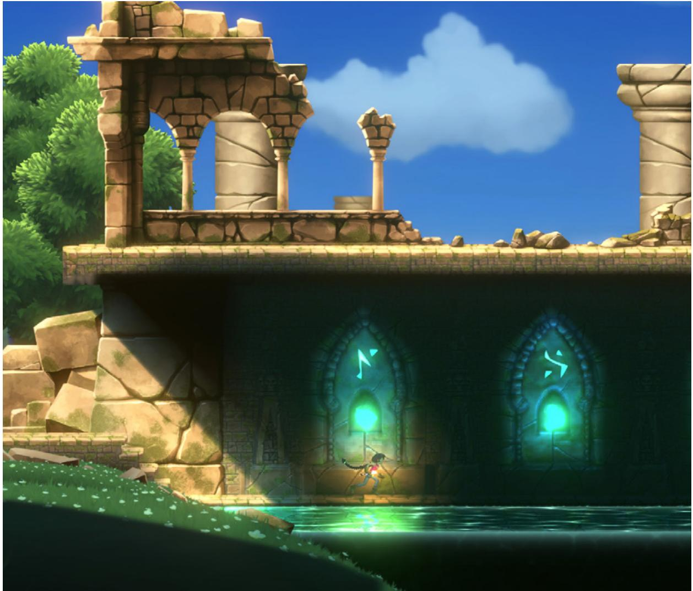

*Lost Crypt* demonstrates Unity's 2D features.

If you're new to Unity, also check out the Asset Store team's [top picks for new users.](https://assetstore.unity.com/new-to-unity-asset-store?utm_source=demand-gen&utm_medium=pdf&utm_campaign=asset-links-gmg-choose-unity-for-multiplatform&utm_content=game-dev-field-guide-ebook)

#### <span id="page-12-0"></span>**Unity GitHub repository**

The [Unity Technologies GitHub](https://github.com/Unity-Technologies) repository has a number of projects demonstrating specific features or topics. Not all projects run with the latest version of Unity, but you can use the Hub to install the matching Unity version. Many repositories are still Experimental or in Preview, so you can evaluate new features for your next production.

Here are few notable projects:

— *[Boss Room](https://unity.com/demos/small-scale-coop-sample?utm_source=demand-gen&utm_medium=pdf&utm_campaign=asset-links-gmg-choose-unity-for-multiplatform&utm_content=game-dev-field-guide-ebook)* is a small-scale cooperative game sample project built on top of the new [experimental netcode library](https://unity.com/products/netcode?utm_source=demand-gen&utm_medium=pdf&utm_campaign=asset-links-gmg-choose-unity-for-multiplatform&utm_content=game-dev-field-guide-ebook) and the [MLAPI](https://docs-multiplayer.unity3d.com/?utm_source=demand-gen&utm_medium=pdf&utm_campaign=asset-links-gmg-choose-unity-for-multiplatform&utm_content=game-dev-field-guide-ebook). It's designed to help you explore the concepts and patterns behind a multiplayer game flow with access to one dungeon level with four character classes to work on gameplay battling stylized enemies and the eponymous boss.


*Boss Room*

— The [Unity Machine Learning Agents Toolkit](https://docs-multiplayer.unity3d.com/?utm_source=demand-gen&utm_medium=pdf&utm_campaign=asset-links-gmg-choose-unity-for-multiplatform&utm_content=game-dev-field-guide-ebook) (ML-Agents) is an open source project that enables games and simulations to train intelligent agents for 2D, 3D, and VR/AR applications. Researchers can also use the provided Python API to apply reinforcement learning, imitation learning, or other machine learning methods to in-game actors.

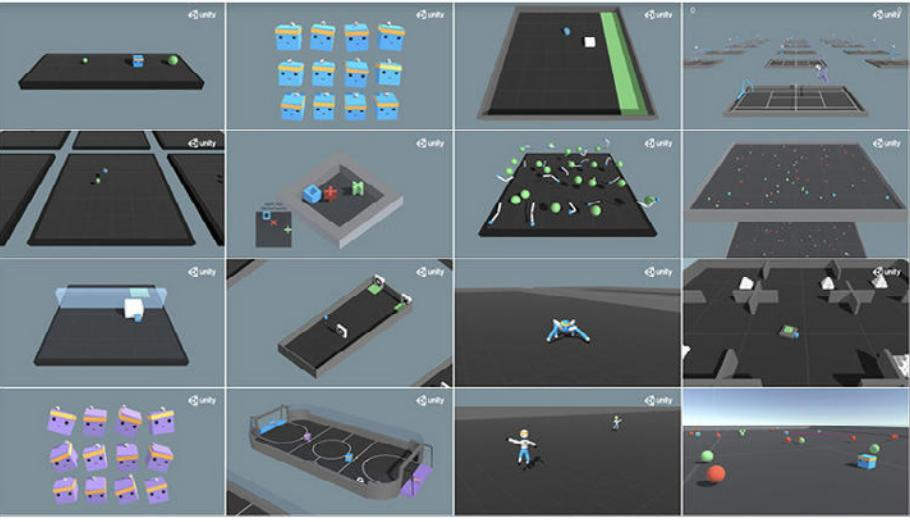

ML-Agents toolkit

### <span id="page-14-0"></span>**Editor interface**

Unity has a flexible, modular user interface. If you've never used the Unity Editor before, refer to [this quick overview of the main windows](https://docs.unity3d.com/Manual/UsingTheEditor.html?utm_source=demand-gen&utm_medium=pdf&utm_campaign=asset-links-gmg-choose-unity-for-multiplatform&utm_content=game-dev-field-guide-ebook).


The Editor's main windows

#### <span id="page-14-1"></span>**The main windows**

**[Game view](https://docs.unity3d.com/Manual/GameView.html?utm_source=demand-gen&utm_medium=pdf&utm_campaign=asset-links-gmg-choose-unity-for-multiplatform&utm_content=game-dev-field-guide-ebook)**: This previews the game's main camera and how a player will interact with the game. This includes the [Rendering statistics](https://docs.unity3d.com/Manual/RenderingStatistics.html?utm_source=demand-gen&utm_medium=pdf&utm_campaign=asset-links-gmg-choose-unity-for-multiplatform&utm_content=game-dev-field-guide-ebook) window in the top right, which shows graphics and audio stats to help you optimize your application. In the top left, Aspect Ratio allows you to preview multiple screen resolutions or define your own target resolution.

|                                                                                                                                                                                  | Statistics                                                                                                                                  |  |
|----------------------------------------------------------------------------------------------------------------------------------------------------------------------------------|---------------------------------------------------------------------------------------------------------------------------------------------|--|
| Audio (suspended):                                                                                                                                                               |                                                                                                                                             |  |
| Level: - 74.8 dB<br>Clipping: 0.0%                                                                                                                                               | DSP load: 0.8%<br>Stream load: 0.0%                                                                                                         |  |
| Graphics:<br>Tris: 160.0k<br>Screen: 1512x850 - 14.7 MB<br>SetPass calls: 1380<br>Visible skinned meshes: 0<br>Animation components playing: 0<br>Animator components playing: 0 | 0.4 FPS (2520.3ms)<br>CPU: main 2520.3ms render thread 41.6ms<br>Batches: 1320 Saved by batching: 370<br>Verts: 180.5k<br>Shadow casters: 0 |  |

Rendering statistics Aspect ratio

**[Scene view](https://docs.unity3d.com/Manual/UsingTheSceneView.html?utm_source=demand-gen&utm_medium=pdf&utm_campaign=asset-links-gmg-choose-unity-for-multiplatform&utm_content=game-dev-field-guide-ebook):** This view shows the objects that comprise each scene. You will primarily work here in the Editor to place models, lights, physics bodies, and so on. Use the [control bar](https://docs.unity3d.com/Manual/ViewModes.html?utm_source=demand-gen&utm_medium=pdf&utm_campaign=asset-links-gmg-choose-unity-for-multiplatform&utm_content=game-dev-field-guide-ebook) to change the Draw Mode, useful for troubleshooting and quick diagnostics. The [Gizmos menu](https://docs.unity3d.com/Manual/GizmosMenu.html?utm_source=demand-gen&utm_medium=pdf&utm_campaign=asset-links-gmg-choose-unity-for-multiplatform&utm_content=game-dev-field-guide-ebook) controls icons and overlay graphics for certain GameObjects.


Draw Mode and Gizmos menus

**[Hierarchy window](https://docs.unity3d.com/Manual/Hierarchy.html?utm_source=demand-gen&utm_medium=pdf&utm_campaign=asset-links-gmg-choose-unity-for-multiplatform&utm_content=game-dev-field-guide-ebook)**: This window shows objects in the currently active scene and how they relate to one another in parent-child relationships.

The Hierarchy includes a useful interface to override the visibility and pickability of objects in the Scene view. This UI does not affect the Game view. It's designed to help you navigate complex scenes with a large number of GameObjects.

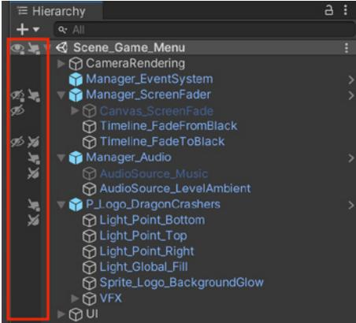

Scene visibility and pickability overrides Scene view

**[Inspector window](https://docs.unity3d.com/Manual/UsingTheInspector.html?utm_source=demand-gen&utm_medium=pdf&utm_campaign=asset-links-gmg-choose-unity-for-multiplatform&utm_content=game-dev-field-guide-ebook)**: This shows properties and settings for the selected objects and offers powerful options for customization. [Focused Inspectors](https://docs.unity3d.com/Manual/InspectorFocused.html?utm_source=demand-gen&utm_medium=pdf&utm_campaign=asset-links-gmg-choose-unity-for-multiplatform&utm_content=game-dev-field-guide-ebook) can help you open an Inspector window for any specific GameObject, asset, or component to simplify comparison of gameplay variables or scene objects. Inspectors allow you to adjust them at runtime without needing to go into the code each time, making playtesting more interactive and facilitating a faster workflow.

**[Project window](https://docs.unity3d.com/Manual/ProjectView.html?utm_source=demand-gen&utm_medium=pdf&utm_campaign=asset-links-gmg-choose-unity-for-multiplatform&utm_content=game-dev-field-guide-ebook)**: Unity stores all assets that create the game (Prefabs, Textures, models, animations, scripts) as files on disk. The Project window gives you easy access to these files – think of this as a content directory or library where your ingame resources reside. Use the Search bar to locate specific assets or types.

**[Toolbar](https://docs.unity3d.com/Manual/Toolbar.html?utm_source=demand-gen&utm_medium=pdf&utm_campaign=asset-links-gmg-choose-unity-for-multiplatform&utm_content=game-dev-field-guide-ebook)**: This appears at the top of the Editor, locked to the Application window's title bar. Use the buttons here to control the Editor Play mode and see how your published application plays. The Hand tool pans the scene, while the Move/Rotate/Scale/Rect Transform/Transform tools allow you to manipulate GameObjects.

**[The Console window](https://docs.unity3d.com/Manual/Console.html?utm_source=demand-gen&utm_medium=pdf&utm_campaign=asset-links-gmg-choose-unity-for-multiplatform&utm_content=game-dev-field-guide-ebook)**: The Console window is used for debugging and shows errors, warnings, and other messages generated by Unity (see the [Debug](https://docs.unity3d.com/Manual/class-Debug.html?utm_source=demand-gen&utm_medium=pdf&utm_campaign=asset-links-gmg-choose-unity-for-multiplatform&utm_content=game-dev-field-guide-ebook) class). Everything written to the Console window, either by Unity or by your own code, also outputs to a [Log File](https://docs.unity3d.com/Manual/LogFiles.html?utm_source=demand-gen&utm_medium=pdf&utm_campaign=asset-links-gmg-choose-unity-for-multiplatform&utm_content=game-dev-field-guide-ebook).

#### <span id="page-16-0"></span>**Editor Play mode**

The Game view is rendered from the Camera(s) in your application. It represents your final, published application. In Play mode, any changes you make are temporary, and they are reset when you exit Play mode. The Editor UI darkens to remind you that any changes you make in Play mode are not saved.

Remember that you will need to use one or more Cameras to control what the player sees at runtime. For more information, see the [Camera](https://docs.unity3d.com/Manual/class-Camera.html?utm_source=demand-gen&utm_medium=pdf&utm_campaign=asset-links-gmg-choose-unity-for-multiplatform&utm_content=game-dev-field-guide-ebook)  [component page.](https://docs.unity3d.com/Manual/class-Camera.html?utm_source=demand-gen&utm_medium=pdf&utm_campaign=asset-links-gmg-choose-unity-for-multiplatform&utm_content=game-dev-field-guide-ebook)

For more specific information about each part of the interface, Unity Learn also includes an [overview](https://learn.unity.com/tutorial/using-the-unity-interface?utm_source=demand-gen&utm_medium=pdf&utm_campaign=asset-links-gmg-choose-unity-for-multiplatform&utm_content=game-dev-field-guide-ebook).

### <span id="page-17-0"></span>**Version control**

Whether it's Plastic, Git, [Perforce](https://docs.unity3d.com/Manual/perForceIntegration.html?utm_source=demand-gen&utm_medium=pdf&utm_campaign=asset-links-gmg-choose-unity-for-multiplatform&utm_content=game-dev-field-guide-ebook), or another system, Unity allows you to choose which source control solution works best for you and your team.

Unity has in-Editor integrations with two industry-leading version control systems, Perforce and [Plastic SCM.](https://docs.unity3d.com/Manual/plasticSCMIntegration.html?utm_source=demand-gen&utm_medium=pdf&utm_campaign=asset-links-gmg-choose-unity-for-multiplatform&utm_content=game-dev-field-guide-ebook) You must have either a Perforce or Plastic SCM server set up for your project to use with Unity.


PlasticSCM makes version control simple with its streamlined interface.

Before using source control, navigate to **Project Settings > Editor**. Confirm that **Asset Serialization Mode** is set to **Force Text**. Unity uses [serialization](https://docs.unity3d.com/Manual/script-Serialization-BuiltInUse.html?utm_source=demand-gen&utm_medium=pdf&utm_campaign=asset-links-gmg-choose-unity-for-multiplatform&utm_content=game-dev-field-guide-ebook) to load and save Assets to and from disk. Force Text means that Unity will store the scene files in a text-based format to help with version control merges.

|                                                                          |   | Project Settings |   |                    |         |
|--------------------------------------------------------------------------|---|------------------|---|--------------------|---------|
| Project Settings                                                         |   |                  |   |                    |         |
|                                                                          |   |                  | a |                    |         |
| Services<br>Ads<br>Analytics                                             | 1 | Version Control  |   |                    | th<br>* |
| Cloud Build<br>Cloud Diagnostics<br>Collaborate                          |   | Mode             |   | Visible Meta Files | D       |
| In-App Purchasing<br>Tags and Layers<br>TextMesh Pro<br>Time<br>Timeline |   |                  |   |                    |         |
| Version Control                                                          |   |                  |   |                    |         |
| XR Plugin Management                                                     | D |                  |   |                    |         |

Version Control in the Project Settings

Navigate to **Project Settings > Editor > Version Control**. According to your version control system, switch to the mode **Plastic SCM**, **Perforce**, or **Visible Meta Files** (for external source control like Git).


Plastic SCM

#### <span id="page-18-0"></span>**Plastic SCM**

[Plastic SCM](https://www.plasticscm.com/) is our recommended version control system for Unity game development. This solution offers the best experience when dealing with large binary files (>500 MB), so your art assets can have the same level of management as you would expect for your code.

Plastic SCM allows you to work knowing that both your art and programming assets are securely backed up. In addition, the intuitive visual interface simplifies branching and versioning.

Here are some of the key benefits of Plastic SCM:

- **Speed:** Creating branches in a large codebase is significantly faster in Plastic than in Perforce or Git.
- **Simplicity for non-coders:** Artists on your team can work in [Gluon mode.](https://www.plasticscm.com/gluon) This simplified workflow allows them to check out their part of the project, work, and commit their changes, while removing irrelevant parts of the interface.
- **Cloud hosting:** Plastic offers a native solution called [Plastic Cloud Edition,](https://www.plasticscm.com/plasticscm-cloud-edition) designed with fully distributed teams in mind. If your team doesn't want to consider running its own servers and prefers hosting everything online, try Plastic Cloud Edition.
- **Distributed Version Control:** Set up different repositories in remote offices so teams always work "locally." This is a Git-like workflow at a larger scale. Use the graphical interface to push and pull changes as well as solve remote conflicts.
- **Diff window:** Plastic features a complete interface to view changed, added, or deleted files. The GUI also includes a separate image diff tool to help you compare two revisions of a texture asset.

When using Plastic SCM, open the **Plastic SCM** window (**Window > Plastic SCM**) to view the files in your changelist.

| 900          |                        |                                                                                                                                                                                | Plastic SCM                           |        |            |                                            |      |            |  |
|--------------|------------------------|--------------------------------------------------------------------------------------------------------------------------------------------------------------------------------|---------------------------------------|--------|------------|--------------------------------------------|------|------------|--|
|              |                        |                                                                                                                                                                                |                                       |        |            |                                            |      |            |  |
|              | (p) Plastic SCM        |                                                                                                                                                                                |                                       |        |            |                                            |      |            |  |
|              |                        | Branch /main @ SampleScene @ GameAcademy_School@cloud                                                                                                                          |                                       |        |            |                                            |      |            |  |
|              | Pending Changes        | Incoming changes                                                                                                                                                               | Changesets                            |        |            | Launch branch explorer Launch Plastic      |      |            |  |
| 5 changesets |                        |                                                                                                                                                                                | Hide changes                          | Search |            |                                            |      | Last Month |  |
| Name         | Creation date          | Created by                                                                                                                                                                     | Comment                               | Branch | Repository |                                            | Guid |            |  |
| 4            | 8/16/2021 4:33:38      | C I simpling of I and Children                                                                                                                                                 | Turned directional light to -45 /main |        |            | SampleScene@Game b07626d0-1bbf-47c4-be5c   |      |            |  |
| 3            | 8/16/2021 4:31:45      | =                                                                                                                                                                              | Project setup cont'd                  | /main  |            | SampleScene@Game. 61f190d0-1f56-4422-9ab2- |      |            |  |
| 2            | 8/16/2021 4:21:45      | Congrindiana                                                                                                                                                                   | Sample URP project setup              | /main  |            | SampleScene@Game. f1b3457b-4533-44a9-b48c  |      |            |  |
|              | 8/16/2021 4:19:40 ■    |                                                                                                                                                                                | Add packages and project setti /main  |        |            | SampleScene@Game. d6fdc810-e7e5-4c14-86ca- |      |            |  |
| 0            |                        | 8/16/2021 3:58:31 ============================================================================================================================================================ | Root dir                              | /main  |            | SampleScene@Game. 0497ef04-4c81-4090-8458  |      |            |  |
|              |                        |                                                                                                                                                                                |                                       |        |            |                                            |      |            |  |
|              |                        |                                                                                                                                                                                |                                       |        |            |                                            |      |            |  |
|              | Changes of changeset 4 |                                                                                                                                                                                |                                       |        |            | a Search                                   |      |            |  |
|              | C Changed: 1 item      |                                                                                                                                                                                |                                       |        |            |                                            |      |            |  |
|              |                        | /Assets/Scenes/SampleScene.unity                                                                                                                                               |                                       |        |            |                                            |      |            |  |
|              |                        |                                                                                                                                                                                |                                       |        |            |                                            |      |            |  |

PlasticSCM window

The **Pending changes** tab lists all of the local changes that are pending a commit into version control. The **Incoming changes** tab allows you to view all incoming changes and conflicts and update your local project. Any changes made to your project prompts an "Incoming changes" notification at the top right of the Plastic SCM window.

Refer to the [Version control integrations](https://docs.unity3d.com/Manual/Versioncontrolintegration.html?utm_source=demand-gen&utm_medium=pdf&utm_campaign=asset-links-gmg-choose-unity-for-multiplatform&utm_content=game-dev-field-guide-ebook) documentation for more information about the Version Control Window. To learn more, watch the [Version Control for games with](https://www.youtube.com/watch?v=PjPK6hxGUFU)  [Plastic SCM](https://www.youtube.com/watch?v=PjPK6hxGUFU) video from Unite Now, or check out the [Plastic SCM Book](https://www.plasticscm.com/documentation?_ga=2.22126527.569799824.1627259012-442985442.1621785835&_gac=1.113237366.1624370310.Cj0KCQjwlMaGBhD3ARIsAPvWd6gY0S7jfnVw6LMHkvPY5dwng0I1j53ukd2z5GzCKLMffLnRFTIsk6AaAtXVEALw_wcB) to get started.

#### <span id="page-19-0"></span>**Git**

Unity developers can also use external source control solutions such as Git. This, however, requires some initial manual setup of the project.

To use Git with Unity, create an empty repository on your local machine and optionally sync this to the cloud via GitHub. Be sure to include [Git LFS \(Large File](https://git-lfs.github.com)  [Support\)](https://git-lfs.github.com) for more efficient version control of your larger assets, like graphics and sound resources. Unity maintains a [.gitignore](https://github.com/github/gitignore/blob/master/Unity.gitignore) file that can help you decide what should and shouldn't go into the Git repository.

For the added convenience of working with the GitHub hosting service, install the [GitHub for Unity plug-in.](https://unity.github.com) This open source extension allows you to view your project history, experiment in branches, commit your changes, and push your code to GitHub without leaving Unity.

Also, consider any of the capable visual clients like [GitKraken,](https://www.gitkraken.com) [SourceTree](https://www.sourcetreeapp.com), or [GitHub Desktop](https://desktop.github.com).


Create a repository using GitHub.

For a walkthrough of setting up Unity with Git, watch the [Introduction](https://www.youtube.com/watch?v=ISW2nS_v3Ic)  [to Version Control](https://www.youtube.com/watch?v=ISW2nS_v3Ic) video, which covers the basics of using a visual GitHub client with a sample project.

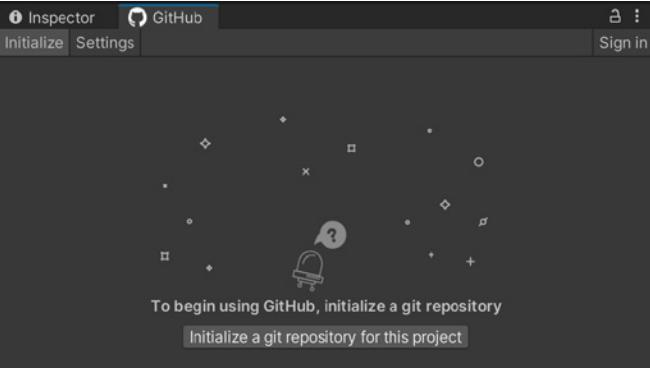

The GitHub for Unity extension

#### <span id="page-20-0"></span>**Perforce**

If Perforce is your source control of choice, use [Helix Core](https://www.perforce.com/products/helix-core) to manage your code, artwork, and game engine assets. Helix Core is [free](https://www.perforce.com/products/helix-core/free-version-control) for up to five users and 20 workspaces.

Perforce has good performance, even with [remote teams](https://www.perforce.com/blog/vcs/collaborative-game-development-remote) distributed around the world. Many AAA or indie game dev studios use Perforce as their primary source control.

#### To use it:

- Follow the setup process described in the Unity [Version Control](https://docs.unity3d.com/Manual/Versioncontrolintegration.html) documentation.
- Read how to set up [Perforce Helix Core with Unity](https://www.perforce.com/blog/vcs/how-to-use-unity-version-control).
- Consult the [Perforce documentation](https://www.perforce.com/perforce/doc.current/manuals/p4v/) for more detail about Perforce Helix Core.

## <span id="page-21-0"></span>**Project organization**

As your project grows, you will need to maintain a level of organization so that it can scale with your team and application requirements. These general tips will help you to establish your basic project and scene structure.

#### <span id="page-21-1"></span>**The Project view**

The Project window displays all of the files related to your project. This is the content directory where you will find assets and other project files in your application.

Unity stores the source files directly in the project, alongside individual .meta files. Meta files contain engine- and Editor-specific data for the associated asset.

Unity also imports each asset into an optimized format which the engine uses at runtime. These processed assets appear in the Library folder, which serves as a cache and does not need to be added to source control.

The project window has a few UI features to assist with navigation:

- **Right-click** to reveal the context menu for frequently used commands (creating/importing assets, revealing full path on disk, etc.).
- Use the **Search** field to locate assets as your project grows in size. If you're looking for a particular type of asset, filter by type using the t: syntax (e.g., **t:Material** will filter for all material assets in the project). This can help you to navigate large projects.
- Drag a frequently used folder into the **Favorites** field at the top of the interface. You can also save a search to the Favorites with the **Save Search** button.
- You can also change the layout of the window itself. Select the **More Items** ( ) menu in the top right of the window, and choose from either **One Column Layout** or **Two Column Layout**. The two-column layout has an extra pane with a visual preview of each file.


One-column vs two-column layout

Inside of the Project window is the **Assets folder**. This contains the assets used to build your game. If you've started your project with a template, you should see subfolders that represent several common assets. While most of these are userdefined, Unity does reserve a few folder names for specific purposes. Make sure you are aware of this list of [Special folder names.](https://docs.unity3d.com/Manual/SpecialFolders.html?utm_source=demand-gen&utm_medium=pdf&utm_campaign=asset-links-gmg-choose-unity-for-multiplatform&utm_content=game-dev-field-guide-ebook)

The following are some common subdirectories that you might use to organize your project, although these vary by team and project according to preferences. Above all, stay consistent – create a style guide and follow it.

| Animations | This folder contains animated motion clips and their controller<br>files, as well as Timeline assets for in-game cinematics or<br>rigging information for procedural animation.                                                                                          |
|------------|--------------------------------------------------------------------------------------------------------------------------------------------------------------------------------------------------------------------------------------------------------------------------|
| Audio      | Sound assets include audio clips as well as the mixers used for<br>blending effects and music.                                                                                                                                                                           |
| Editor     | This folder contains scripted tools made for use with the Unity<br>Editor but not appearing in a target build.                                                                                                                                                           |
| Fonts      | The fonts used in the game.                                                                                                                                                                                                                                              |
| Gizmos     | Having a Gizmo icon can help visualize a GameObject in the<br>Scene or Game view, especially if it does not have a mesh. Store<br>the image files for these icons in the Gizmos folder.                                                                                  |
| Materials  | These assets describe surface shading properties.                                                                                                                                                                                                                        |
| Meshes     | Store models created in an external DCC application here.                                                                                                                                                                                                                |
| Particles  | Manage particle simulations in Unity, created either with the<br>ParticleSystem or Visual Effect Graph.                                                                                                                                                                  |
| Prefabs    | These are reusable GameObjects with prebuilt components.<br>Add them to a scene to build your levels and gameplay.                                                                                                                                                       |
| Scripts    | All user-developed code for gameplay appears here.                                                                                                                                                                                                                       |
| Scenes     | Unity stores small, functional portions of your project in scene<br>assets. They often correspond to game levels or part of a level.                                                                                                                                     |
| Settings   | Assets store render pipeline settings for both HDRP and URP.                                                                                                                                                                                                             |
| Shaders    | These programs run on the GPU as part of the graphics pipeline.                                                                                                                                                                                                          |
| Textures   | Image files can consist of texture files for materials and<br>surfacing, UI overlay elements for user interface, and lightmaps<br>to store lighting information.                                                                                                         |
| ThirdParty | If you have assets from an external source like the Asset Store,<br>keep them separated from the rest of your project here. This<br>makes updating your third-party assets and scripts easier.<br>Third-party assets may have a set structure that cannot be<br>altered. |

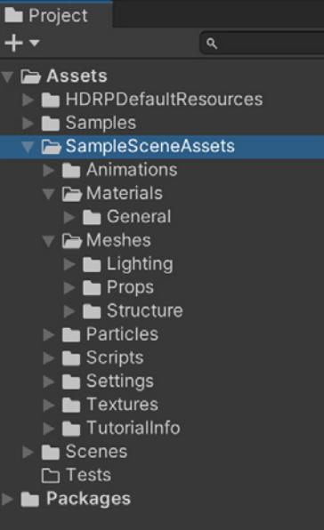

The Sample Scene with the HDRP template includes several asset folders.

The [Supported Asset Types](https://docs.unity3d.com/Manual/AssetTypes.html?utm_source=demand-gen&utm_medium=pdf&utm_campaign=asset-links-gmg-choose-unity-for-multiplatform&utm_content=game-dev-field-guide-ebook) manual page describes the most common assets in more detail. You can use the Template or Learn projects as an example of how to organize your folders effectively. While you're not limited to these folder names, this list should give you a good starting point that you can expand upon as your project scales up.

You are of course free to adapt the folder structure to your specific project's needs and team preferences, as in the image below.


Organize folders for your project needs, but stay consistent once you decide on a structure.

#### <span id="page-24-0"></span>**Folder structure and naming**

While there's no single way to organize your project, we recommend that you follow these best practices in general:

- **Document your naming conventions and folder structure**. A style guide and/or project template makes your files easier to find and organize.
- **Whatever naming convention you choose, make sure you remain consistent**. Don't deviate from your chosen style guide or template. If you do need to amend your naming rules, parse and rename your affected assets all at once with a script.
- **Don't use spaces in file and folder names**. Unity's command line tools have issues with path names that have spaces.
- **Separate your testing or sandbox areas**. Create a separate folder for non-production scenes and experimentation. Subfolders with usernames can divide your work area by team member.
- **Avoid extra folders at the root leve**l. In general, store your content files within the Assets folder. Don't create additional folders at the project's root level unless absolutely necessary.

#### <span id="page-24-1"></span>**Scenes**

[Scenes](https://docs.unity3d.com/Manual/CreatingScenes.html?utm_source=demand-gen&utm_medium=pdf&utm_campaign=asset-links-gmg-choose-unity-for-multiplatform&utm_content=game-dev-field-guide-ebook) are where you work with content in Unity. They contain the objects of your game and can be used to create a main menu, individual levels, and anything else. In each unique scene, you will place the environments, obstacles, and decorations that roughly translate into one level of your game. This enables you to design and build your application piece by piece, keeping it modular.

The scene files themselves are assets that are stored on disk. If you use Force Text Mode for [Asset Serialization,](https://docs.unity3d.com/Manual/class-EditorManager.html?utm_source=demand-gen&utm_medium=pdf&utm_campaign=asset-links-gmg-choose-unity-for-multiplatform&utm_content=game-dev-field-guide-ebook) they appear as text files; otherwise, they default to binaries.

Scenes often represent a level of your game or a portion of a level. While demos and simple games might occupy just a single scene, most commercial games might use one scene per level, each with its own environments, characters, UI, etc.

You can create any number of scenes in a project, but be aware that how you structure your scenes can have a significant performance impact. For more info on scene organization and performance, check out our [mobile performance](https://create.unity3d.com/optimize-mobile-game-eBook?utm_source=demand-gen&utm_medium=pdf&utm_campaign=asset-links-gmg-choose-unity-for-multiplatform&utm_content=game-dev-field-guide-ebook)  [optimization guide.](https://create.unity3d.com/optimize-mobile-game-eBook?utm_source=demand-gen&utm_medium=pdf&utm_campaign=asset-links-gmg-choose-unity-for-multiplatform&utm_content=game-dev-field-guide-ebook)

You'll need to [create, create, load](https://docs.unity3d.com/Manual/scenes-working-with.html#loading-scenes?utm_source=demand-gen&utm_medium=pdf&utm_campaign=asset-links-gmg-choose-unity-for-multiplatform&utm_content=game-dev-field-guide-ebook), and save scenes to represent different portions of your game and flesh out your application. A typical "scene flow" involves triggering the loading of another scene with an event. For example, you may have a menu scene that loads up a main gameplay scene when the user clicks the interface. Note that you can load scenes one at a time, or separate elements and load the scenes additively.

When creating a new scene, Unity allows you to select from a set of [Scene](https://docs.unity3d.com/Packages/com.unity.scene-template@1.0/manual/index.html?utm_source=demand-gen&utm_medium=pdf&utm_campaign=asset-links-gmg-choose-unity-for-multiplatform&utm_content=game-dev-field-guide-ebook)  [Templates.](https://docs.unity3d.com/Packages/com.unity.scene-template@1.0/manual/index.html?utm_source=demand-gen&utm_medium=pdf&utm_campaign=asset-links-gmg-choose-unity-for-multiplatform&utm_content=game-dev-field-guide-ebook) For example, the HDRP 3D Sample Scene comes with several templates. You can define your own scene templates to streamline your workflow and start everyone on your team with the same assets and configuration.

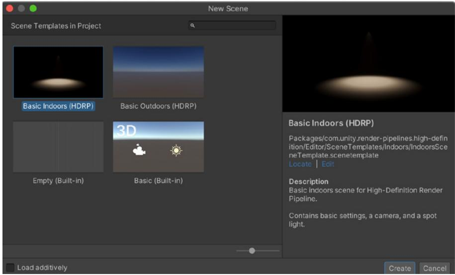

Scene templates in HDRP

Unity provides a [SceneManagement API](https://docs.unity3d.com/ScriptReference/SceneManagement.SceneManager.html?utm_source=demand-gen&utm_medium=pdf&utm_campaign=asset-links-gmg-choose-unity-for-multiplatform&utm_content=game-dev-field-guide-ebook) for loading or managing scenes from scripts. See this [Learn tutorial on scene flow](https://learn.unity.com/tutorial/create-a-scene-flow?missionId=5f751af7edbc2a0022cdbbb6#60b73ec3edbc2a54f80c097f?utm_source=demand-gen&utm_medium=pdf&utm_campaign=asset-links-gmg-choose-unity-for-multiplatform&utm_content=game-dev-field-guide-ebook) for more information.

#### <span id="page-26-0"></span>**The Hierarchy window**

The Hierarchy window displays every [GameObject](https://docs.unity3d.com/Manual/GameObjects.html?utm_source=demand-gen&utm_medium=pdf&utm_campaign=asset-links-gmg-choose-unity-for-multiplatform&utm_content=game-dev-field-guide-ebook) in the currently loaded scene's assets. These include your models, Cameras, and [Prefabs.](https://docs.unity3d.com/Manual/Prefabs.html?utm_source=demand-gen&utm_medium=pdf&utm_campaign=asset-links-gmg-choose-unity-for-multiplatform&utm_content=game-dev-field-guide-ebook) Simply drag a GameObject to change its parenting.

Adding or removing objects in the Scene view also adds or removes them from the Hierarchy window (and vice versa). The Hierarchy window can show more than one loaded scene at runtime, with each scene containing its own GameObjects.

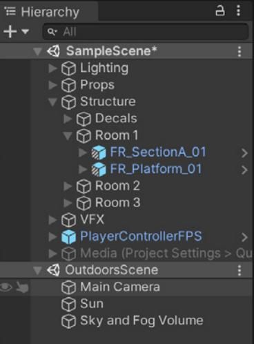

The Sample Scene with the HDRP template includes several asset folders.

#### <span id="page-26-1"></span>**General tips for scenes and hierarchies**

— **Use named, empty GameObjects as spacers.** Carefully organize your scenes to make it easy to find objects. Keep these to a minimum, as every GameObject matters. Balance your organizational needs with performance. Avoid unnecessary parenting for organization (see **Use proper parenting** below).

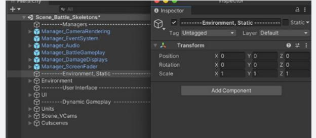

Caption: Empty game objects serve as spacers.

— **Put maintenance Prefabs and empty GameObjects at world origin.** If a transform is not specifically used to position an object, it should be at (0,0,0). This simplifies code and reduces issues converting between local and world space.

- **Put your world floor at y = 0**. This makes it easier to put objects on the floor. Treat the world as a 2D space along the xz-plane for game logic, AI, and physics.
- **Separate dynamic and static objects**. If you generate moving objects at runtime, consider keeping them organized under an empty placeholder object. Likewise, store non-moving level geometry in a different part of the hierarchy. This can help you apply the appropriate lighting techniques to your geometry (e.g., [lightmapping](https://docs.unity3d.com/Manual/Lightmapping.html?utm_source=demand-gen&utm_medium=pdf&utm_campaign=asset-links-gmg-choose-unity-for-multiplatform&utm_content=game-dev-field-guide-ebook) versus [probe lighting](https://docs.unity3d.com/Manual/LightProbes.html?utm_source=demand-gen&utm_medium=pdf&utm_campaign=asset-links-gmg-choose-unity-for-multiplatform&utm_content=game-dev-field-guide-ebook)).
- **Use proper parenting**. Group related objects by function. Use common sense when creating hierarchies (e.g., parent the tires so that they are children of the car body). Avoid unnecessary parenting when possible, as a flatter hierarchy is more performant. Follow [these guidelines](https://blog.unity.com/technology/best-practices-from-the-spotlight-team-optimizing-the-hierarchy?utm_source=demand-gen&utm_medium=pdf&utm_campaign=asset-links-gmg-choose-unity-for-multiplatform&utm_content=game-dev-field-guide-ebook) for scene hierarchies.

#### <span id="page-27-0"></span>**Naming standards**

While there is no definitive naming standard for GameObjects, consider the following standards and practices for your project.

| Standard                                                                                                                                                                                                                                                                                          | Example                                                                                                                                                              |  |  |  |
|---------------------------------------------------------------------------------------------------------------------------------------------------------------------------------------------------------------------------------------------------------------------------------------------------|----------------------------------------------------------------------------------------------------------------------------------------------------------------------|--|--|--|
| Use descriptive names. Don't abbreviate.<br>Use names that you will remember several<br>months from now. Consider whether<br>another person will understand your<br>notation, and choose names that you can<br>pronounce and remember. Be aware that<br>abbreviations can create confusion.       | largeButton, LargeButton, or<br>leftButton<br>NOT:<br>lButton                                                                                                        |  |  |  |
| Use Camel case/Pascal case. Avoid<br>spaces in your object names. Camel case<br>or Pascal case improve readability (and<br>typing accuracy, according to this study).                                                                                                                             | OutOfMemoryException,<br>dateTimeFormat,<br>NOT:<br>Outofmemoryexception,<br>datetimeformat                                                                          |  |  |  |
| Use underscores (or hyphens) sparingly.<br>Avoid underscores and hyphens in<br>general. However, they can be useful in<br>certain circumstances. Prefixing a name<br>with an underscore puts it alphabetically<br>first. You can also use underscores to<br>denote variants of a specific object. | Active states:<br>EnterButton_Active,<br>EnterButton_Inactive<br>maps:<br>Foliage_Diffuse, Foliage_<br>Normalmap<br>Level of detail:<br>Building_LOD1, Building_LOD0 |  |  |  |
| Use number suffixes to denote a<br>sequence. Don't suffix with a number if it's<br>not part of a list.                                                                                                                                                                                            | For a path, name the nodes:<br>Node0, Node1, Node2, etc.                                                                                                             |  |  |  |
| Follow the design document naming.                                                                                                                                                                                                                                                                | If your design document names<br>locations like HighSpellTower or<br>RedDragonLair, use those exact<br>spellings.                                                    |  |  |  |

As with all naming standards, decide on what works for your team and apply it *consistently*.

### <span id="page-28-0"></span>**GameObjects and components**

Gameplay and interactivity in Unity is constructed from **GameObjects** and **components**. These are the fundamental building blocks for your Unity project. Create them in the interface or using script.

Everything in your game hierarchy is a [GameObject](https://docs.unity3d.com/Manual/GameObjects.html). GameObjects are essentially empty containers that don't do anything on their own. They can represent a wide range of things in your game, from a character to an environment to a particle effect.

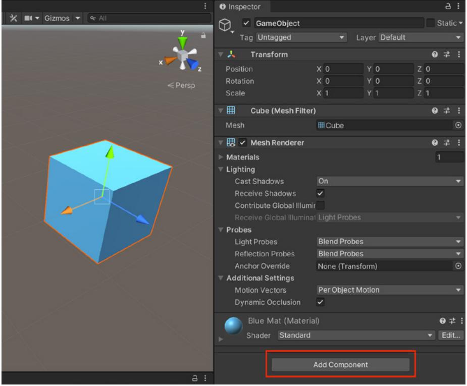

Adding a component changes its functionality.

You need to add special [components](https://docs.unity3d.com/Manual/Components.html?utm_source=demand-gen&utm_medium=pdf&utm_campaign=asset-links-gmg-choose-unity-for-multiplatform&utm_content=game-dev-field-guide-ebook) to a GameObject before they can become a functional part of your game. Each GameObject can hold more than one component. Often components work together in concert or by communicating with components on other GameObjects.

Depending on what functionality you want to create, you will add different combinations of components to the GameObject. You can also make your own components using Scripts.

#### <span id="page-29-0"></span>**The Inspector**

Components have any number of [editable properties,](https://docs.unity3d.com/Manual/UsingComponents.html?utm_source=demand-gen&utm_medium=pdf&utm_campaign=asset-links-gmg-choose-unity-for-multiplatform&utm_content=game-dev-field-guide-ebook) or variables, that can be changed using the Inspector window. You can also modify these variables with your custom scripts.

|   | ▼ ▲ √ Light         |                | � 花  |
|---|---------------------|----------------|------|
| A | Type                | Spot           | œ    |
|   | Range               | 10             |      |
|   | Spot Angle          |                | - 30 |
|   | Color               |                | 8    |
|   | Mode                | Baked          | D    |
|   | Intensity           |                |      |
|   | Indirect Multiplier |                |      |
|   | Shadow Type         | No Shadows     | >    |
|   | Cookie              | None (Texture) | 0    |
|   | Draw Halo           |                |      |
|   | Flare               | None (Flare)   | 0    |
|   | Render Mode         | Auto           | C    |
|   | Culling Mask        | Everything     | D    |
|   |                     |                |      |
|   |                     | Add Component  |      |
|   |                     |                |      |

Modify an example light's range, color, and intensity in the Inspector window.

Use the Inspector to enter or reset values. The Help icon also gives you quick access to documentation, while the Presets feature lets you quickly save or load values. You can use the **More Items** () menu to reorder components or to copy and paste values.


Use the Help, Preset, and More Items menus to manage your components

#### <span id="page-30-0"></span>**The Transform component**

Every GameObject in Unity has a [Transform component](https://docs.unity3d.com/Manual/class-Transform.html?utm_source=demand-gen&utm_medium=pdf&utm_campaign=asset-links-gmg-choose-unity-for-multiplatform&utm_content=game-dev-field-guide-ebook) for its position, rotation, and scale. You cannot remove this component. Transform values in the Inspector for any child GameObject are displayed relative to its parent's transform in local coordinates.

Transform scale determines the size of a mesh in Unity compared to the mesh size in your modeling application. This is important for the physics engine, which assumes one unit in world space is one meter.

Like many 3D applications, Unity represents rotations as [Quaternions](https://en.wikipedia.org/wiki/Quaternions_and_spatial_rotation) internally, but it shows values of the equivalent [Euler angles](https://en.wikipedia.org/wiki/Quaternions_and_spatial_rotation) in the Inspector for easier editing.

#### <span id="page-30-1"></span>**Tips for working with transforms**

— **Clear transformation values before adding the child.** Set the parent's Transform position and/or rotations to (0,0,0) when adding a transform as a child. Unity compensates for any existing values to keep the child object in the same world space position when reparenting.

If the parent is untransformed, the local coordinates for the child will be the same as its global coordinates. This keeps the setup simple.

— **Use the correct Tool/Pivot mode.** When moving, rotating, and scaling, be aware of your tool settings in the Toolbar. Unity includes a [toggle between Pivot and Center mode](https://docs.unity3d.com/Manual/PositioningGameObjects.html?utm_source=demand-gen&utm_medium=pdf&utm_campaign=asset-links-gmg-choose-unity-for-multiplatform&utm_content=game-dev-field-guide-ebook); this switches the Gizmo handle between the model pivot and the center of the selection, respectively. Likewise, be aware of toggling between Local and Global coordinate systems.

Tool settings

- **If an object needs to sit or stand on the floor, put its pivot at the base, not in the center.** This makes it easy to put characters and objects on the floor precisely. In a 3D project, you can work in a top-down view on the xz-plane more easily.
- **Make all meshes face in the same direction.** This applies to meshes such as characters and other objects that have the concept of facing a direction. Consistency makes many calculations at runtime much simpler.

— **Get the scale right from the beginning.** Make art assets so that they can all be imported at a scale factor of 1 with their x, y, and z scale axes at 1.

Use a reference object (**GameObject > 3D Object > Cube**) to make quick scale comparisons. Avoid non-uniform scales on the root transform if you do need to scale. Otherwise, this can lead to unexpected results when adding child transforms.

— **If you are using Rigidbody components for physics simulation, then model at 1 unit = 1 meter.** Otherwise, compensate using the Mesh Scale Factor in the model's Import Settings. Large objects appear to fall in slow motion because we perceive speed relatively (e.g., a mouse and an elephant traveling the same speed in world units appear differently to the human eye because of how they move relative to their own body sizes).

A physics simulation may be correct, even if the perceived speed does not appear to be. See the [Rigidbody](https://docs.unity3d.com/Manual/class-Rigidbody.html?utm_source=demand-gen&utm_medium=pdf&utm_campaign=asset-links-gmg-choose-unity-for-multiplatform&utm_content=game-dev-field-guide-ebook) component reference page for more about how mesh scale affects physics

#### <span id="page-31-0"></span>**Built-in components**

Add components to the selected GameObject using the Components menu. For example, if you add a Rigidbody (**Add Component > Physics > Rigidbody**) to a 3D cube, you will see the Rigidbody's properties appear in the Inspector.

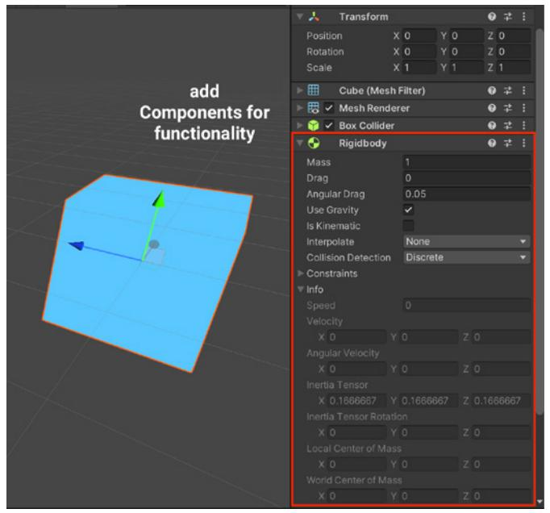

Add native components for greater functionality (Rigidbody in this example).

Press **Play** while the empty GameObject is still selected, and the physics engine in Unity causes the GameObject to fall under gravity. The Rigidbody has added functionality to the otherwise empty GameObject.

You'll use combinations of components to create unique gameplay. Built-in components give you access to sounds, rendering, AI navigation, and more. You'll uncover more features as you continue on your journey into the Editor.

#### <span id="page-32-0"></span>**Custom components**

While built-in components add many abilities to your GameObjects, you will inevitably need to add your own behaviors using [Unity's Scripting API](https://docs.unity3d.com/Manual/CreatingAndUsingScripts.html?utm_source=demand-gen&utm_medium=pdf&utm_campaign=asset-links-gmg-choose-unity-for-multiplatform&utm_content=game-dev-field-guide-ebook). Custom scripted components can trigger game events, check for collisions, apply physics, respond to user input, and much, much more.

When you create a script and attach it to a GameObject, the script appears in the GameObject's Inspector, just like a built-in component, and you can tweak its values as you test your game design in the Editor. Scripts become components once they save and compile in your project.

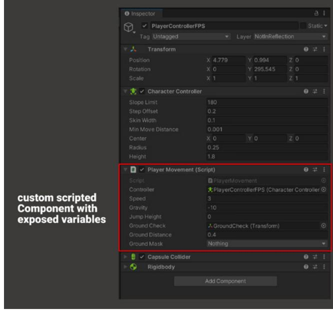

An example of a custom scripted component

Scripts attached to GameObjects inherit from a built-in class called MonoBehaviour. Making **MonoBehaviours** interact with one another is core to creating gameplay in Unity.

The [Unity Scripting API](https://docs.unity3d.com/ScriptReference/index.html?utm_source=demand-gen&utm_medium=pdf&utm_campaign=asset-links-gmg-choose-unity-for-multiplatform&utm_content=game-dev-field-guide-ebook) details every class available to the UnityEngine and UnityEditor. We recommend that you first familiarize yourself with the [manual](https://docs.unity3d.com/Manual/index.html?utm_source=demand-gen&utm_medium=pdf&utm_campaign=asset-links-gmg-choose-unity-for-multiplatform&utm_content=game-dev-field-guide-ebook), then dive deeper as you begin to explore.

### <span id="page-33-0"></span>**Prefabs**

Unity's Prefab system allows you to create, configure, and store a GameObject as a reusable asset. This keeps all of its components, property values, and child GameObjects intact. The Prefab asset in a project acts as a template to create new Prefab instances in the scene.

When you want to reuse a GameObject configured in a particular way, convert it to a Prefab.

#### <span id="page-33-1"></span>**Prefab usage**

You can use Prefab instances for many of the GameObjects in your hierarchy. A Prefab can be anything you want to replicate; it could be a character (either player or NPC), a prop, or part of the level geometry. Some common examples of Prefab use include:

- **Environmental assets:** If you want to reuse the same tree or building several times in a level, convert those meshes into Prefabs.
- **Non-player characters (NPCs):** A certain type of character may appear in your game several times, across multiple levels. Use overrides to make them differ by behavior, visuals, or sounds.
- **Projectiles or power-ups:** Use Prefabs when you want to [instantiate](https://docs.unity3d.com/Manual/InstantiatingPrefabs.html?utm_source=demand-gen&utm_medium=pdf&utm_campaign=asset-links-gmg-choose-unity-for-multiplatform&utm_content=game-dev-field-guide-ebook)  [GameObjects at runtime](https://docs.unity3d.com/Manual/InstantiatingPrefabs.html?utm_source=demand-gen&utm_medium=pdf&utm_campaign=asset-links-gmg-choose-unity-for-multiplatform&utm_content=game-dev-field-guide-ebook) that did not exist in your scene at the start. For example, your laser gun might instantiate a particle effect each time it fires.
- **The player's main character:** The player Prefab might be placed at the starting point for each level of your game (or in a separate scene loaded additively).

Changes can automatically sync to the Prefabs, simplifying the process of modifying your assets and propagating changes to your scene.

#### <span id="page-33-2"></span>**Creating Prefab assets and instances**

To create a Prefab asset, drag a GameObject from the Hierarchy window into the Project window. The GameObject, including its components and child GameObjects, becomes a new asset in your Project window.

Prefabs assets appear either with a blue cube Prefab icon or thumbnail view of the GameObject, depending on whether your Project view uses a one-column ortwo column layout.

Likewise, drag the Prefab asset from the Project view to the hierarchy or scene view to create a Prefab instance.

| : | Hierarchy            | a<br>                                                        | Project       |              |
|---|----------------------|--------------------------------------------------------------|---------------|--------------|
|   | Q- All               |                                                              | +<br>Q<br>V   | X            |
|   | SimpleDemo           |                                                              | Assets        |              |
|   | T Environment        |                                                              | Art           |              |
|   | Cirectional Light    |                                                              | Audio         |              |
|   | B<br>Ground          |                                                              | Code          |              |
|   | 8<br>Cube            |                                                              | Docs<br>E     |              |
|   | Cube (1)             |                                                              | Editor        |              |
|   | B<br>Cube (2)        |                                                              | Level         |              |
|   | 8<br>Cube (3)        |                                                              | Prefabs       |              |
|   | 8<br>Cube (4)        |                                                              | Player        | Prefab asset |
|   | B<br>Cube (5)        | drag the asset to                                            | Setup1        |              |
|   | Cube (6)<br>Cube (7) | hierarchy to create                                          | Setup2        |              |
|   | Spot Light           | an instance                                                  | Scenes        |              |
|   | Player               |                                                              | ال 2          |              |
|   |                      |                                                              | Samples       |              |
|   | Prefab instance      |                                                              | Packages<br>D |              |
|   |                      |                                                              |               |              |
|   |                      | drag any GameObject<br>to project view to<br>create an asset |               |              |

Creating a Prefab asset and instance

Any changes made to the Prefab asset on disk update automatically on the instances in the scene. This way you don't need to make the same edit to every copy of the asset.

This does not mean all Prefab instances have to be identical. You can [override](https://docs.unity3d.com/Manual/PrefabInstanceOverrides.html?utm_source=demand-gen&utm_medium=pdf&utm_campaign=asset-links-gmg-choose-unity-for-multiplatform&utm_content=game-dev-field-guide-ebook) settings on individual prefab instances to make them differ from other instances or from the original asset.

#### <span id="page-34-0"></span>**Prefab mode**

To edit a Prefab asset, you can open it in a special **Prefab Mode**. Prefab Mode allows you to view and edit the contents of the Prefab asset either separately in isolation or in the context of the other GameObjects in your scene. Changes that you make in Prefab Mode affect all instances of that Prefab.


Prefab Mode in isolation (left) or in context (right)

#### <span id="page-35-0"></span>**Prefab Variants and Nested Prefabs**

You can create [variants](https://docs.unity3d.com/Manual/PrefabVariants.html?utm_source=demand-gen&utm_medium=pdf&utm_campaign=asset-links-gmg-choose-unity-for-multiplatform&utm_content=game-dev-field-guide-ebook) of Prefabs which allow you to design a meaningful modification of a Prefab. Think of it like inheriting from an archetypal asset and then overriding just the parts you want to change.


Variants of the same base Prefab

[Nest Prefabs](https://docs.unity3d.com/Manual/NestedPrefabs.html?utm_source=demand-gen&utm_medium=pdf&utm_campaign=asset-links-gmg-choose-unity-for-multiplatform&utm_content=game-dev-field-guide-ebook) inside other Prefabs to create complex hierarchies of objects that are easy to edit at multiple levels. A Nested Prefab instance has a plus badge overlayed on its icon in the hierarchy. That indicates it overrides that specific instance of the outer Prefab.

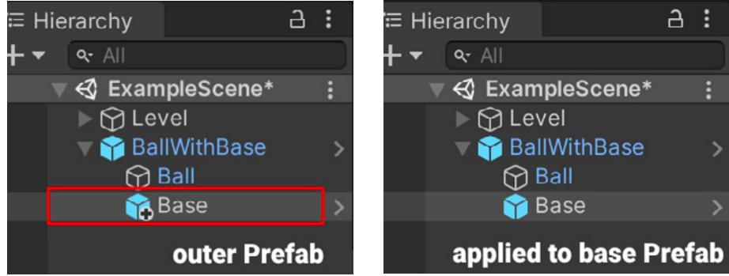

Nested Prefabs, with the "outer" Prefab denoted by the plus badge

Edit the source Prefab assets independently, propagating changes into the Nested Prefabs.

### <span id="page-36-0"></span>**Package Manager**

To make development more flexible, Unity offers some features as optional add-on packages. These exist outside of the core Editor so that they can follow a more rapid release cycle. The package management system keeps your build small, as it allows you to only install the tools that you need for your specific project requirements. Packages themselves can vary in functionality. They can contain any combination of assets, shaders, textures, plug-ins, icons, and scripts to enhance various parts of your project.

Manage available packages using the **Package Manager** window (**Window > Package Manager**).

In addition to Unity-provided packages that are built-in or part of the Unity registry, you can also install custom packages from disk, GitHub URL, or the Asset Store:

- Click the button to [install a package](https://docs.unity3d.com/Manual/upm-ui-actions.html?utm_source=demand-gen&utm_medium=pdf&utm_campaign=asset-links-gmg-choose-unity-for-multiplatform&utm_content=game-dev-field-guide-ebook) directly from git URL or a local path.
- The **[Packages](https://docs.unity3d.com/Manual/upm-ui-filter.html?utm_source=demand-gen&utm_medium=pdf&utm_campaign=asset-links-gmg-choose-unity-for-multiplatform&utm_content=game-dev-field-guide-ebook)** drop-down menu changes what appears in the list (Unity Registry/In project/My Assets/Built-in). Meanwhile, the [Sort](https://docs.unity3d.com/Manual/upm-ui-sort.html?utm_source=demand-gen&utm_medium=pdf&utm_campaign=asset-links-gmg-choose-unity-for-multiplatform&utm_content=game-dev-field-guide-ebook) menu organizes packages by name or date.
- Asset Store packages from **My Assets** feature [additional filtering options.](https://docs.unity3d.com/Manual/upm-ui-filter2.html?utm_source=demand-gen&utm_medium=pdf&utm_campaign=asset-links-gmg-choose-unity-for-multiplatform&utm_content=game-dev-field-guide-ebook)
- The **Search** field allows you to locate a package by name. Use the Download, Import, and/or Update buttons to manage the packages in use by your project.

| 0 0                                       |          | Package Manager                                                                                                                                 |  |  |  |  |
|-------------------------------------------|----------|-------------------------------------------------------------------------------------------------------------------------------------------------|--|--|--|--|
| Package Manager                           |          |                                                                                                                                                 |  |  |  |  |
| + + Packages: In Project + Sort: Name ↓ ▼ |          | 8 9                                                                                                                                             |  |  |  |  |
| V Unity Technologies                      |          | Unity Ul Verified                                                                                                                               |  |  |  |  |
| JetBrains Rider Editor                    | 2.0.7 V  | Unity Technologies                                                                                                                              |  |  |  |  |
| > Test Framework                          | 1.1.26 G | Version 1.0.0 - June 12, 2021                                                                                                                   |  |  |  |  |
| > TextMeshPro                             | 3.0.6 V  | View documentation · View changelog · View licenses                                                                                             |  |  |  |  |
| Timeline                                  | 1.4.8 V  | Unity UI is a Ul toolkit for developing user interfaces for games and                                                                           |  |  |  |  |
| Unity Ul<br>A                             | 1.0.0 V  | applications. It is a GameObject-based Ul system that uses Components<br>and the Game View to arrange, position, and style user interfaces. You |  |  |  |  |
| Version Control<br>A                      | 1.5.7 V  | More                                                                                                                                            |  |  |  |  |
| Visual Studio Code Editor<br>4            | 1.2.3 V  |                                                                                                                                                 |  |  |  |  |
| Visual Studio Editor                      | 2.0.9 G  |                                                                                                                                                 |  |  |  |  |
|                                           |          |                                                                                                                                                 |  |  |  |  |
| Last update Jul 25, 19:48                 | C -      | Remove                                                                                                                                          |  |  |  |  |

The Package Manager

Experienced developers can also leverage the PackageManager API to build their own shared libraries. Watch [Creating Custom Packages in Unity](https://www.youtube.com/watch?v=mgsLb3TKljk) for a quick introduction.

### <span id="page-37-0"></span>**Programming**

In Unity, you can use code to customize and control just about any part of your game, create visual tools for your team, and even change the way Unity itself works. Unity uses C#, a modern object-oriented language adopted widely in software industries.

#### <span id="page-37-1"></span>**Custom components and MonoBehaviours**

Every type of GameObject comes with a set of default components. For example, an empty GameObject starts with the Transform component. But you can extend this default collection with custom components that can tie your own game logic directly to objects your team uses in game scenes. You can even empower your designers to tweak values and behavior through values in your components.

To do this, [create scripts,](https://docs.unity3d.com/Manual/CreatingAndUsingScripts.html?utm_source=demand-gen&utm_medium=pdf&utm_campaign=asset-links-gmg-choose-unity-for-multiplatform&utm_content=game-dev-field-guide-ebook) then add those scripts as components to GameObjects. Each script derives from the built-in class called **[MonoBehaviour](https://docs.unity3d.com/ScriptReference/MonoBehaviour.html?utm_source=demand-gen&utm_medium=pdf&utm_campaign=asset-links-gmg-choose-unity-for-multiplatform&utm_content=game-dev-field-guide-ebook)**.

Think of the MonoBehaviour class as a kind of blueprint for creating a new component type. Each time you attach a script component to a GameObject, the blueprint defines a new instance of that particular component.

Scripts are created directly within Unity. If you use the **Assets** menu (or **rightclick**) **> Create > C# Script**, this generates a new C# script on disk. Name the filename to match your desired class name. Drag this onto an object in the hierarchy, and the inspector shows the ExampleScript appears as a component.

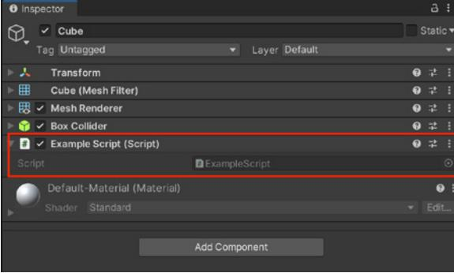

A new C# script

Note: If you change the name of the class inside the file but not the filename, it can cause the script to not function properly when attached as a custom component. Unity will automatically set up a class named **ExampleScript** that inherits from MonoBehaviour.

Unity's current script template starts the class with two functions, **Start** and **Update**.

```
using System.Collections;
using System.Collections.Generic;
using UnityEngine;
public class ExampleScript : MonoBehaviour
{
 // Start is called before the first frame update
 void Start()
 {
 }

// Update is called once per frame
 void Update()
 {
 }
}
```
Unity calls the **Start** function before gameplay begins and before it calls the Update function for the first time. Thus, the Start function is an ideal place to set up variables, read preferences, and make connections with other GameObjects.

The **Update** function handles code that runs every frame. For example, this might include movement, triggering actions, and responding to user input.

**Update** and **Start** are only two of MonoBehaviour's event functions. These built-in methods run on a set order of execution. Overriding MonoBehaviour's event functions is how you will construct gameplay and build the main game loop.

To familiarize yourself with the basics of coding in Unity, check out our documentation [here](https://docs.unity3d.com/ScriptReference/).

#### <span id="page-38-0"></span>**Initializing objects**

Experienced programmers may be surprised that initializing an object is not done using a constructor. The Editor handles object construction, which does not take place at the start of gameplay. Attempting to define a constructor for a script component will interfere with the normal operation of Unity and can cause problems.

#### <span id="page-39-0"></span>**MonoBehaviour lifecycle and structure**

Game engines rely on an endless loop responsible for processing user input, updating game state, and rendering to the screen. In Unity, this **PlayerLoop** is a low-level class at the heart of the game engine. It controls a number of subsystems that handle initialization and per-frame updates.

To interface with the PlayerLoop, your scripts derive from the [MonoBehaviour](https://docs.unity3d.com/ScriptReference/MonoBehaviour.html?utm_source=demand-gen&utm_medium=pdf&utm_campaign=asset-links-gmg-choose-unity-for-multiplatform&utm_content=game-dev-field-guide-ebook) base class, and learning how this operates is key to creating gameplay. This [flowchart](https://docs.unity3d.com/Manual/ExecutionOrder.html?utm_source=demand-gen&utm_medium=pdf&utm_campaign=asset-links-gmg-choose-unity-for-multiplatform&utm_content=game-dev-field-guide-ebook) shows MonoBehaviour's event functions and how they execute over a script's lifetime.

Here are some [essential parts of the game loop](https://docs.unity3d.com/Manual/ExecutionOrder.html#BeforeTheFirstFrameUpdate?utm_source=demand-gen&utm_medium=pdf&utm_campaign=asset-links-gmg-choose-unity-for-multiplatform&utm_content=game-dev-field-guide-ebook) when working with MonoBehaviours:

- First scene load
- Editor
- Before the first frame update
- In between frames
- Update order
- Animation update loop
- Rendering
- Coroutines
- When the object is destroyed
- When quitting

Experienced users can even build their own [PlayerLoop](https://docs.unity3d.com/ScriptReference/LowLevel.PlayerLoop.html?utm_source=demand-gen&utm_medium=pdf&utm_campaign=asset-links-gmg-choose-unity-for-multiplatform&utm_content=game-dev-field-guide-ebook) and [PlayerLoopSystems.](https://docs.unity3d.com/ScriptReference/LowLevel.PlayerLoopSystem.html?utm_source=demand-gen&utm_medium=pdf&utm_campaign=asset-links-gmg-choose-unity-for-multiplatform&utm_content=game-dev-field-guide-ebook) However, we recommend that you begin by familiarizing yourself with the [Monobehaviour](https://docs.unity3d.com/Manual/class-MonoBehaviour.html?utm_source=demand-gen&utm_medium=pdf&utm_campaign=asset-links-gmg-choose-unity-for-multiplatform&utm_content=game-dev-field-guide-ebook) class and the most common classes below.


MonoBehaviour lifecycle

### <span id="page-41-0"></span>**More scripting tips**

Unity's scripting backend is based on the .NET Framework. Take advantage of these C# features when scripting for Unity development:

— **Namespaces**: Classes in Unity must have unique names. When several programmers check their work into the same project, common names like "Controller" can create conflicts. Use [namespaces](https://docs.microsoft.com/en-us/dotnet/csharp/fundamentals/types/namespaces) to avoid this, and organize your data types. Apply the [using](https://docs.microsoft.com/en-us/dotnet/csharp/language-reference/keywords/using-directive) directive to shorten the namespace prefix if desired.

For example, you could create a namespace for the Player as well as for an Enemy. Then Player.Controller and Enemy.Controller could safely live in the same project.

See the [Namespaces manual page](https://docs.unity3d.com/Manual/Namespaces.html?utm_source=demand-gen&utm_medium=pdf&utm_campaign=asset-links-gmg-choose-unity-for-multiplatform&utm_content=game-dev-field-guide-ebook) for more information.

— **Coroutines**: Sometimes you may want to trigger an action and have it take place over multiple frames. For example, imagine moving an object from A to B over a duration or slowly fading its color. Normally a function runs to completion and returns on the same frame, making it more difficult to perform logic over a timeframe.

A coroutine has the ability to pause execution and return control to Unity, then continue where it left off on the following frame. You can use coroutines to apply game logic for a specified time. For example, pausing execution for a set time is often done via coroutine. You can even use coroutines to wait for other coroutines or combine it with a while loop to wait for a condition. Coroutines can behave like MonoBehaviour's Update event functions but with the added benefit of controlling the update interval.

Refer to the [Coroutine manual page](https://docs.unity3d.com/Manual/Coroutines.html?utm_source=demand-gen&utm_medium=pdf&utm_campaign=asset-links-gmg-choose-unity-for-multiplatform&utm_content=game-dev-field-guide-ebook) for more information.

— **Attributes**: These are markers that can be placed above a class, property, or function to indicate special behaviour.

For example, you can turn a numeric field into a slider in the Inspector using the [Range](https://docs.unity3d.com/ScriptReference/RangeAttribute.html?utm_source=demand-gen&utm_medium=pdf&utm_campaign=asset-links-gmg-choose-unity-for-multiplatform&utm_content=game-dev-field-guide-ebook) attribute or add a floating [Tooltip](https://docs.unity3d.com/ScriptReference/TooltipAttribute.html?utm_source=demand-gen&utm_medium=pdf&utm_campaign=asset-links-gmg-choose-unity-for-multiplatform&utm_content=game-dev-field-guide-ebook) over a field in the Inspector. C# contains attribute names within square brackets.

You can find a complete list of [Attributes](https://docs.unity3d.com/Manual/Attributes.html?utm_source=demand-gen&utm_medium=pdf&utm_campaign=asset-links-gmg-choose-unity-for-multiplatform&utm_content=game-dev-field-guide-ebook) in the [Scripting API.](https://docs.unity3d.com/ScriptReference/AddComponentMenu.html?utm_source=demand-gen&utm_medium=pdf&utm_campaign=asset-links-gmg-choose-unity-for-multiplatform&utm_content=game-dev-field-guide-ebook)

#### <span id="page-42-0"></span>**Common classes**

Once you start scripting in Unity, you should review some of the most important built-in classes. While this list is not exhaustive, it should help you start exploring Unity. See the [Scripting API](https://docs.unity3d.com/ScriptReference/?utm_source=demand-gen&utm_medium=pdf&utm_campaign=asset-links-gmg-choose-unity-for-multiplatform&utm_content=game-dev-field-guide-ebook) for a complete list of classes for more information.

| Class                 | Description                                                                                                                                                                                 |
|-----------------------|---------------------------------------------------------------------------------------------------------------------------------------------------------------------------------------------|
| GameObject            | Represents the type of objects which can exist in a scene                                                                                                                                   |
| MonoBehaviour         | The base class from which every Unity script derives                                                                                                                                        |
| Object                | The base class for all objects that Unity can reference in<br>the Editor                                                                                                                    |
| Transform             | Provides you with a variety of ways to work with a<br>GameObject's position, rotation, and scale via script, as<br>well as its hierarchical relationship to parent and child<br>GameObjects |
| Vectors               | Classes for expressing and manipulating 2D, 3D, and 4D<br>points, lines, and directions                                                                                                     |
| Quaternion            | A class which represents an absolute or relative rotation,<br>and provides methods for creating and manipulating them                                                                       |
| ScriptableObject      | A data container that you can use to save large<br>amounts of data                                                                                                                          |
| Time                  | This class allows you to measure and control time, and<br>manage the frame rate of your project                                                                                             |
| Mathf                 | A collection of common math utilities, including<br>trigonometric, logarithmic, and other functions                                                                                         |
| Random                | Provides you with easy ways of generating various<br>commonly required types of random values                                                                                               |
| Debug                 | Allows you to visualize information in the Editor that may<br>help you understand or investigate what is going on in<br>your project while it is running                                    |
| Gizmos and<br>Handles | Allows you to draw lines and shapes in the Scene view<br>and Game view, as well as interactive handles and controls                                                                         |

#### <span id="page-43-0"></span>**Memory management**

Unity supports **[C#](https://docs.microsoft.com/en-us/dotnet/csharp/)**, an industry-standard language with some similarities to Java or C++. C# is a "managed language." It automatically handles memory management for you: allocating and deallocating memory, covering memory leaks, and so on.

In some languages like C++, the programmer is responsible for allocating and releasing these blocks of heap memory with the appropriate function calls. By contrast, automatic memory management in C# requires less coding effort than explicit allocation/release, while greatly reducing the potential for memory leakage (where memory is allocated but never subsequently released).

#### <span id="page-43-1"></span>**Value versus reference types**

When you call a function, Unity reserves an area of memory for it and copies the values of the function's parameters as well. *Value types*, like integers, floats, and booleans, only occupy a few bytes. Unity stores value types directly and copies them during parameter passing.

Other data types (like objects, strings, and arrays) are *reference types*. They occupy more space and would be inefficient to copy on a regular basis. Instead, Unity stores their data in heap memory and accesses them via pointers. Thus, if you only need a struct (*value type*), using that can be more efficient than if you use a class (*reference type*) to hold the same data.

Although you won't need to allocate and release memory explicitly, you *will* need to understand managed heap memory and how it affects the performance of your game application.

#### <span id="page-43-2"></span>**Garbage collection**

Blocks of heap memory are "live" if they are still in use and have active references.

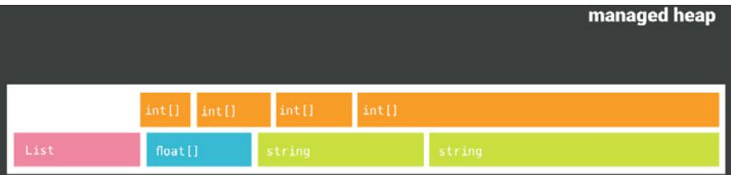

The Managed Memory Allocator automatically allocates heap memory.

As your game runs, references to a block of memory may disappear (GameObjects get destroyed, variables get reassigned, etc.). Once all references to a memory block are gone, the **Managed Memory Allocator** can safely reuse the memory.

Periodically, the allocator searches the empty spaces between live blocks of memory. Locating and freeing up unused memory is known as garbage collection, or GC for short. When the game application requests new blocks of memory, the allocator draws from these unused blocks.


Garbage collection frees up unused memory but pauses execution of your script code.

Unity implements the [Boehm–Demers–Weiser](https://www.hboehm.info/gc/) garbage collector. During **garbage collection**, Unity stops running your program code, and it only resumes normal execution when the garbage collector finishes.

This interruption can cause delays in the execution of your application, which depend on how much memory the garbage collector needs to process and the game's target platform. These can vary, anywhere from less than one millisecond to hundreds of milliseconds.

For real-time applications like games, this can become quite a big issue. Interruptions from garbage collection, called GC spikes, can cause game play to stutter. Even though garbage collection is invisible for the most part, the collection process actually requires significant CPU time behind the scenes.

Also, be aware that the [Boehm GC algorithm](https://en.wikipedia.org/wiki/Boehm_garbage_collector) is non-compacting. It does not move existing objects in memory to close the gaps between objects, which can lead to memory fragmentation. If you try to allocate a new object that does not fit within the existing gaps, the allocator may need to expand the size of the heap to accommodate it. [Heap expansion](https://docs.unity3d.com/Manual/BestPracticeUnderstandingPerformanceInUnity4-1.html?utm_source=demand-gen&utm_medium=pdf&utm_campaign=asset-links-gmg-choose-unity-for-multiplatform&utm_content=game-dev-field-guide-ebook) can impact performance.

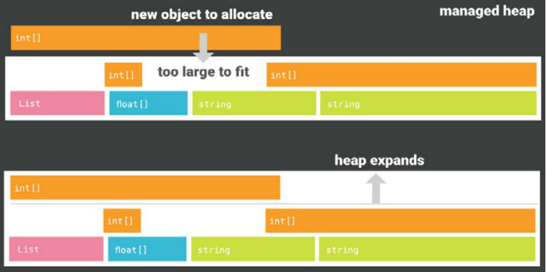

Be aware that the heap can expand.

In Unity, you need to avoid triggering the garbage collector more often than necessary. Otherwise, your application could freeze or stutter at runtime. Check out [this blog post](https://blog.unity.com/technology/optimize-your-mobile-game-performance-tips-on-profiling-memory-and-code-architecture?utm_source=demand-gen&utm_medium=pdf&utm_campaign=asset-links-gmg-choose-unity-for-multiplatform&utm_content=game-dev-field-guide-ebook) for optimization tips and tricks that can help reduce the impact of garbage collection.

Unity also offers an optional **Incremental Garbage Collector** that splits GC over multiple frames. This feature is currently Experimental and detailed in [this blog post.](https://blog.unity.com/technology/feature-preview-incremental-garbage-collection?utm_source=demand-gen&utm_medium=pdf&utm_campaign=asset-links-gmg-choose-unity-for-multiplatform&utm_content=game-dev-field-guide-ebook)

See [Understanding Automatic Memory Management](https://docs.unity3d.com/Manual/UnderstandingAutomaticMemoryManagement.html?utm_source=demand-gen&utm_medium=pdf&utm_campaign=asset-links-gmg-choose-unity-for-multiplatform&utm_content=game-dev-field-guide-ebook) and [Understanding](https://docs.unity3d.com/Manual/BestPracticeUnderstandingPerformanceInUnity4-1.html?utm_source=demand-gen&utm_medium=pdf&utm_campaign=asset-links-gmg-choose-unity-for-multiplatform&utm_content=game-dev-field-guide-ebook)  [the managed heap](https://docs.unity3d.com/Manual/BestPracticeUnderstandingPerformanceInUnity4-1.html?utm_source=demand-gen&utm_medium=pdf&utm_campaign=asset-links-gmg-choose-unity-for-multiplatform&utm_content=game-dev-field-guide-ebook) in the Unity documentation for more information about memory management and garbage collection. You can also read the [Memory](https://learn.unity.com/tutorial/memory-management-in-unity#5c7f8528edbc2a002053b599?utm_source=demand-gen&utm_medium=pdf&utm_campaign=asset-links-gmg-choose-unity-for-multiplatform&utm_content=game-dev-field-guide-ebook)  [Management in Unity](https://learn.unity.com/tutorial/memory-management-in-unity#5c7f8528edbc2a002053b599?utm_source=demand-gen&utm_medium=pdf&utm_campaign=asset-links-gmg-choose-unity-for-multiplatform&utm_content=game-dev-field-guide-ebook) guide from the Learn site.

#### <span id="page-45-0"></span>**Multithreading: C# Job System and Burst compiler**

Modern CPUs have multiple cores, but your application needs **multithreaded code** to take advantage of them. Unity's Job System allows you to split large tasks into smaller chunks that run in parallel on those extra CPU cores. This can significantly improve performance.

Often in multithreaded programming, one CPU thread of execution, the *main thread*, creates other threads to handle tasks. These additional *worker threads* then synchronize with the main thread once their work completes.

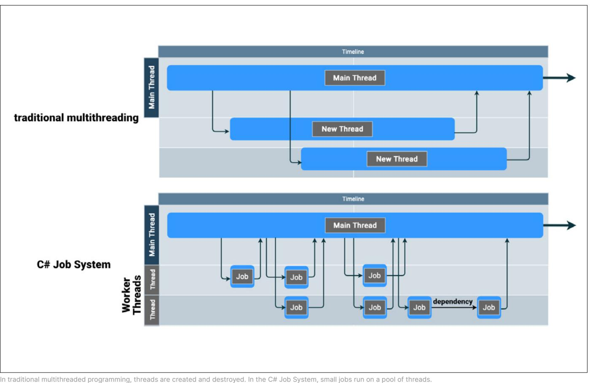

If you have a few tasks that run for a long time, this approach to multithreading works well. However, it's less efficient for a game application, which typically must process many short tasks at 30–60 frames per second.

Thus, Unity uses a slightly different approach to multithreading called the [C# Job System.](https://docs.unity3d.com/Manual/JobSystem.html?utm_source=demand-gen&utm_medium=pdf&utm_campaign=asset-links-gmg-choose-unity-for-multiplatform&utm_content=optimize-game-performance-2020-lts-ebook?utm_source=demand-gen&utm_medium=pdf&utm_campaign=asset-links-gmg-choose-unity-for-multiplatform&utm_content=game-dev-field-guide-ebook) Rather than generate many threads with a short lifetime, it breaks your work into smaller units called jobs.

These jobs go into a [queue,](https://en.wikipedia.org/wiki/Job_queue) which schedules them to run on a shared pool of [worker threads.](https://docs.microsoft.com/en-us/cpp/parallel/multithreading-creating-worker-threads?view=msvc-160) [JobHandles](https://docs.unity3d.com/Manual/JobSystemJobDependencies.html?utm_source=demand-gen&utm_medium=pdf&utm_campaign=asset-links-gmg-choose-unity-for-multiplatform&utm_content=optimize-game-performance-2020-lts-ebook?utm_source=demand-gen&utm_medium=pdf&utm_campaign=asset-links-gmg-choose-unity-for-multiplatform&utm_content=game-dev-field-guide-ebook) help you create dependencies, ensuring the jobs run in the correct order. In order for a safety system to prevent race conditions, jobs work on a copy of the data. Then, [Native Containers](https://docs.unity3d.com/Manual/JobSystemNativeContainer.html?utm_source=demand-gen&utm_medium=pdf&utm_campaign=asset-links-gmg-choose-unity-for-multiplatform&utm_content=game-dev-field-guide-ebook) send the results back to the main thread.

Complementing the Job System is the **[Burst compiler](https://docs.unity3d.com/Packages/com.unity.burst@1.5/manual/index.html?utm_source=demand-gen&utm_medium=pdf&utm_campaign=asset-links-gmg-choose-unity-for-multiplatform&utm_content=optimize-game-performance-2020-lts-ebook?utm_source=demand-gen&utm_medium=pdf&utm_campaign=asset-links-gmg-choose-unity-for-multiplatform&utm_content=game-dev-field-guide-ebook)**. Burst translates IL/.NET bytecode into optimized native code using [LLVM](https://llvm.org/). To access it, simply add the Burst package from the Package Manager. Burst allows Unity developers to continue using a subset of C# for convenience while improving on performance.

#### <span id="page-46-0"></span>**Scripting backends in Unity**

Unity has two scripting backends: Mono and IL2CPP (Intermediate Language To C++). Each uses a different compilation technique:

- **Mono** uses just-in-time (JIT) compilation and compiles code on demand at runtime.
- **IL2CPP** uses ahead-of-time (AOT) compilation and compiles your entire application before it is run.

IL2CPP is a Unity-developed scripting backend which you can use as an alternative to Mono when building projects for some platforms. It can improve performance and reduce build sizes, but this often comes with slower build time.

When you choose to build a project using IL2CPP, Unity converts IL code from scripts and assemblies into C++ code, before creating a native binary file (.exe, apk, .xap, for example) for your chosen platform.

Note that IL2CPP is the only scripting backend available when building for iOS and WebGL.

For more information about using IL2CPP, refer to th[e The Unity IL2CPP blog](https://blogs.unity3d.com/2015/05/06/an-introduction-to-ilcpp-internals/?utm_source=demand-gen&utm_medium=pdf&utm_campaign=asset-links-gmg-choose-unity-for-multiplatform&utm_content=game-dev-field-guide-ebook)  [series](https://blogs.unity3d.com/2015/05/06/an-introduction-to-ilcpp-internals/?utm_source=demand-gen&utm_medium=pdf&utm_campaign=asset-links-gmg-choose-unity-for-multiplatform&utm_content=game-dev-field-guide-ebook) and the [Building a project using IL2CPP](https://docs.unity3d.com/Manual/IL2CPP-BuildingProject.html?utm_source=demand-gen&utm_medium=pdf&utm_campaign=asset-links-gmg-choose-unity-for-multiplatform&utm_content=game-dev-field-guide-ebook) page.

#### <span id="page-46-1"></span>**Editor scripting**

You may want to tailor your development environment to the specific needs of your team and project to work more efficiently.

If you require a specialized workflow, you can [extend the Editor](https://docs.unity3d.com/Manual/ExtendingTheEditor.html?utm_source=demand-gen&utm_medium=pdf&utm_campaign=asset-links-gmg-choose-unity-for-multiplatform&utm_content=game-dev-field-guide-ebook) with your own custom inspectors and windows. These can behave just like the Inspector, Scene, or other built-in windows. You can also define how properties appear with custom Property Drawers.

| 0                       | Custom Heights                                                                                                                                                                 |              |  |  |  |  |  |  |  |  |
|-------------------------|--------------------------------------------------------------------------------------------------------------------------------------------------------------------------------|--------------|--|--|--|--|--|--|--|--|
| Custom Heights          |                                                                                                                                                                                |              |  |  |  |  |  |  |  |  |
| ರ                       |                                                                                                                                                                                |              |  |  |  |  |  |  |  |  |
| V Element 108           |                                                                                                                                                                                |              |  |  |  |  |  |  |  |  |
|                         | --                                                                                                                                                                             | -- 0.603     |  |  |  |  |  |  |  |  |
| · Default-Material      |                                                                                                                                                                                | 0            |  |  |  |  |  |  |  |  |
|                         |                                                                                                                                                                                |              |  |  |  |  |  |  |  |  |
| Element 109<br>>        | ●一                                                                                                                                                                             |              |  |  |  |  |  |  |  |  |
| · Default-Particle      |                                                                                                                                                                                | - 0.467<br>0 |  |  |  |  |  |  |  |  |
|                         |                                                                                                                                                                                |              |  |  |  |  |  |  |  |  |
| Element 110             |                                                                                                                                                                                |              |  |  |  |  |  |  |  |  |
| C                       | ------------------------------------------------------------------------------------------------------------------------------------------------------------------------------ | 0.389        |  |  |  |  |  |  |  |  |
| 9 Default-Skybox        |                                                                                                                                                                                | 0            |  |  |  |  |  |  |  |  |
|                         |                                                                                                                                                                                |              |  |  |  |  |  |  |  |  |
| Element 111<br>V        |                                                                                                                                                                                |              |  |  |  |  |  |  |  |  |
|                         |                                                                                                                                                                                | ● 1          |  |  |  |  |  |  |  |  |
| SpatialMappingOcclusion |                                                                                                                                                                                | 0            |  |  |  |  |  |  |  |  |
| Element 112<br>>        |                                                                                                                                                                                |              |  |  |  |  |  |  |  |  |
|                         | 0.51078                                                                                                                                                                        |              |  |  |  |  |  |  |  |  |
| None (Material)         |                                                                                                                                                                                | 0            |  |  |  |  |  |  |  |  |
|                         |                                                                                                                                                                                |              |  |  |  |  |  |  |  |  |
|                         |                                                                                                                                                                                |              |  |  |  |  |  |  |  |  |
| Expand All              | Collapse All                                                                                                                                                                   |              |  |  |  |  |  |  |  |  |

A custom Editor window

#### <span id="page-47-0"></span>**Odin Inspector and Serializer**

You can reduce the time you spend in the [EditorWindow API](https://docs.unity3d.com/ScriptReference/EditorWindow.html) using Odin Inspector and Serializer, a third-party Unity Verified Solutions Partner tool that you can [purchase on the Unity Asset Store](https://assetstore.unity.com/packages/tools/utilities/odin-inspector-and-serializer-89041). Odin provides over [100 building](https://odininspector.com/attributes)[block attributes](https://odininspector.com/attributes) that let you create custom editors without manually writing and maintaining custom GUI code.

To create a custom editor window with Odin, simply inherit from the [OdinEditor](https://odininspector.com/editor-windows)  [Window](https://odininspector.com/editor-windows) class, and populate your fields, properties, and methods with attributes.

These are just a few of the processes you can define with Odin:

- Customize layouts with group attributes such as [TabGroup](https://odininspector.com/attributes/tab-group-attribute) and [ToggleGroup](https://odininspector.com/attributes/toggle-group-attribute)
- Serialize fields like dictionaries that are normally unavailable with the native Unity Inspector
- Easily create buttons in the Inspector window by adding [button attributes](https://odininspector.com/attributes/button-attribute) to your methods
- Modify static members for testing and debugging; for example, invoke a static method with any arguments directly from the Inspector
- Create custom editors for the Inspector window using attributes
- Write snippets of C# code with attribute expressions directly inside the attributes to reduce boilerplate
- Validate user input with attributes such as Required, ValidateInput, ChildGameObjectsOnly

For example, you can generate an Inspector that looks like this, using a script:

| C INLINE EDITORS    | Draw full editors inside existing editors. No more hopping around! |                 |                                                                              |
|---------------------|--------------------------------------------------------------------|-----------------|------------------------------------------------------------------------------|
| Transform           | Inline Editor Examples                                             | 0               |                                                                              |
| Position            | X 0<br>Y O                                                         | N<br>0          |                                                                              |
| Rotation            | Y O<br>× 0                                                         | Z<br>0          | public class InlineEditorExamples : MonoBehaviour                            |
| Scale               | ×1<br>Y 1                                                          | Z<br>1          | [InlineEditor]                                                               |
| V Material          | Some Material                                                      | C               | public Transform Transform;                                                  |
| Base (RGB)          | None<br>(Texture)                                                  |                 | [InlineEditor(InlineEditorModes.GUIAndPreview)]<br>public Material Material; |
| Tiling<br>×<br>1    | 0                                                                  |                 | [HorizontalGroup]                                                            |
| Offset<br>× 0       | Y O<br>Select                                                      |                 | [InlineEditor(InlineEditorModes.SmallPreview)]<br>public GameObject Gol;     |
|                     |                                                                    |                 | [HorizontalGroup]                                                            |
| V Go 1<br>Capsule / | V Go 2<br>0                                                        | C Sphere<br>1 0 | [InlineEditor(InlineEditorModes.SmallPreview)]                               |
|                     |                                                                    |                 | public GameObject Go2;                                                       |
|                     |                                                                    |                 | // Left click pen to open it in a new inspector                              |
| Normal Field        | P Point light                                                      | 0               | // Right click pen to open it in a mini-popup<br>public Light NormalField;   |
| Type                | Directional                                                        |                 |                                                                              |
| Baking              | Realtime                                                           |                 |                                                                              |
| Color               |                                                                    |                 |                                                                              |

Example created in Odin Inspector

Here is an example of an editor window that was made using Odin:

| RPGEditor Winc |                 |   |                        |              |               |                            |           |   |                    |         |                              | · 人<br>· 三 |
|----------------|-----------------|---|------------------------|--------------|---------------|----------------------------|-----------|---|--------------------|---------|------------------------------|------------|
| Q Search       |                 | 0 | Mead                   |              |               |                            |           |   |                    |         | Create Item Create Character |            |
| Characters     |                 | V | General Settings       |              |               |                            |           |   | Description        |         |                              |            |
| 12             | Baldr           |   |                        | Name<br>Type | Mead<br>Flask |                            |           | 4 |                    |         |                              |            |
| లాల్లి.        | Loki            |   |                        | Prefab       |               | Prefab Related Attributi O |           |   |                    |         |                              |            |
| 1              | Thor            |   | Stats                  |              |               |                            |           |   | Notes              |         |                              |            |
| Armour         |                 |   | Item Stack Size        |              | 20            |                            |           |   |                    |         |                              |            |
|                |                 |   | Item Ranty<br>Cooldown |              | 0.2<br>0.44   |                            | seconds ; |   |                    |         |                              |            |
|                | Armor           |   | Consume Over Time V    |              |               | 0.7                        | seconds : |   |                    |         |                              |            |
| ್ನಾ            | Helmet          |   | Modifiers              |              |               |                            | 7 items   | + |                    |         |                              |            |
| 14             | Megingjord      |   | Social                 |              |               | 0-                         | 62        | × | Requrements        |         | 4 items                      | +          |
| Weapon         |                 | D | Medicine               |              |               |                            | 29        | × | Social<br>Medicine |         | 19<br>0                      | ×          |
|                | Mistletoc Arrow |   | Shooting               |              |               |                            | 86        | X |                    |         |                              |            |
| 1750           |                 |   | Melee                  |              |               |                            | 71        | × | Cooking            |         | 0                            | ×          |
|                | Mjolner         |   | Mining                 |              |               |                            | 84        | × | Mining             |         | 0                            | ×          |
| Consumables    |                 | V | Cooking                |              |               | C                          | 90        | × |                    |         |                              |            |
| 0              | Mead            |   | Crafting               |              |               | 0-2                        | 69        | × |                    |         |                              |            |
| Ca             | New Item        |   |                        |              |               |                            |           |   |                    | NSPECTO |                              |            |

RPG editor window created in Odin

The Odin Inspector is available in both Personal and Enterprise editions from the [Unity Asset Store.](https://assetstore.unity.com?utm_source=demand-gen&utm_medium=pdf&utm_campaign=asset-links-gmg-choose-unity-for-multiplatform&utm_content=game-dev-field-guide-ebook)

#### <span id="page-49-2"></span><span id="page-49-0"></span>**Integrated development environment (IDE) support**

Unity supports several IDEs so that you can work in your preferred development environment. Visual Studio is installed by default with Unity on Windows and macOS. Select your script editor in Preferences (**Unity > Preferences > External Tools > External Script Editor**).

Unity supports the following IDEs out of the box:

- **[Visual Studio](https://visualstudio.microsoft.com)** is the default IDE for Unity on Windows and macOS. On Windows, Unity also includes Visual Studio 2019 Community. On macOS, Unity includes Visual Studio for Mac.
- **[Visual Studio Code](https://code.visualstudio.com)** (Windows, macOS, Linux) is a free, lightweight, and customizable open source code editor known for speed and customizability. For information on using VS Code with Unity, see [Unity](https://code.visualstudio.com/docs/other/unity)  [Development with VS Code.](https://code.visualstudio.com/docs/other/unity)
- **[JetBrains Rider](https://www.jetbrains.com/rider/)** (Windows, macOS, Linux) is built on top of ReSharper and includes most of its features. For more information, see the [JetBrains](https://www.jetbrains.com/lp/dotnet-unity/)  [documentation on Rider for Unity.](https://www.jetbrains.com/lp/dotnet-unity/)

If your text editor of choice is not one of the above with built-in support, you may need to customize your text editor for Unity development. For example, many community members have created packages (plug-ins, extensions, and add-ons) to use [Sublime Text with Unity](https://wiki.unity3d.com/index.php/Using_Sublime_Text_as_a_script_editor).

#### <span id="page-49-1"></span>**Script templates**

As you start creating your custom components, you may find that you make the same changes every time you create a new C# script. For example, you might want to delete the Update event function automatically or add a default namespace. Save yourself a few keystrokes and set up the script template so it fits the task at hand.

Unity uses templates stored in the **ScriptTemplates** resources:

- **Windows:** *C:\Program Files\Unity\Editor\Data\Resources\ScriptTemplates*
- **Mac:**

*/Applications/Hub/Editor/[version]/Unity/Unity.app/Contents/Resources/ ScriptTemplates*

Open and edit these template files as needed, then relaunch the Unity Editor to apply your changes. Be sure to back up both your original template files and the modified ones.

### <span id="page-50-0"></span>**Building and publishing**

One of Unity's strengths is its ability to deploy on multiple platforms. To adjust the publishing settings for your application's build, go to **File > Build Settings**.

Add the relevant scenes to the **Scenes in Build**. The scene that acts as your entry point into the application will have an index of 0.

| Build Settings |  |  |
|----------------|--|--|

The available platforms appear at the lower left. Use the **Install with Unity Hub** option to install support for the other available target platforms. You can also go directly to the **Installs** screen of the Unity Hub and **Add Module** support for any version of Unity. Some consoles, such as PlayStation, Nintendo Switch, or Xbox, require additional modules from the relevant platform publisher.

Note that you will need to appraise [cross-platform considerations](https://docs.unity3d.com/Manual/CrossPlatformConsiderations.html?utm_source=demand-gen&utm_medium=pdf&utm_campaign=asset-links-gmg-choose-unity-for-multiplatform&utm_content=game-dev-field-guide-ebook) when building your application. For example, mobile devices have less storage, memory, and CPU power, so they are also more susceptible to spikes from garbage collection during automatic memory management. You won't be able to port a graphically taxing console game to iOS or Android – at least, not without a great deal of platform-specific optimization.

Also, be aware of input requirements when building for more than one platform. Mobile devices with touchscreens and accelerometers need different settings than platforms with controller or keyboard/mouse input. You can use the new **Input System** to process user input for multiple devices.

[Platform-dependent compilation](https://docs.unity3d.com/Manual/PlatformDependentCompilation.html?utm_source=demand-gen&utm_medium=pdf&utm_campaign=asset-links-gmg-choose-unity-for-multiplatform&utm_content=game-dev-field-guide-ebook) lets preprocessor directives partition your scripts to be specific to a target platform. Combine these with the #if compiler directive or [ConditionalAttributeClass.](https://docs.microsoft.com/en-us/dotnet/api/system.diagnostics.conditionalattribute?redirectedfrom=MSDN&view=net-5.0) If you wanted to add or remove a UI or object for a platform-specific release (e.g., omit a Quit button from an iOS application), then platform-dependent compilation simplifies that logic.

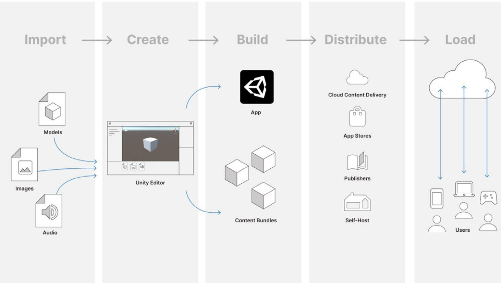

Building and publishing workflow

#### <span id="page-52-0"></span>**Device Simulator**

If you are building for mobile, consider installing the [Device Simulator](https://docs.unity3d.com/Packages/com.unity.device-simulator@3.0/manual/index.html?utm_source=demand-gen&utm_medium=pdf&utm_campaign=asset-links-gmg-choose-unity-for-multiplatform&utm_content=game-dev-field-guide-ebook) using the Package Manager. This lets you view your application on a simulated mobile device to preview its screen shape, resolution, and orientation.

To use the Device Simulator view:

- In the Game view, in the top left corner, there is a drop-down menu. Use this to switch between the Game view and the Device Simulator view.
- Using the top menu, choose **Window > General > Device Simulator**.

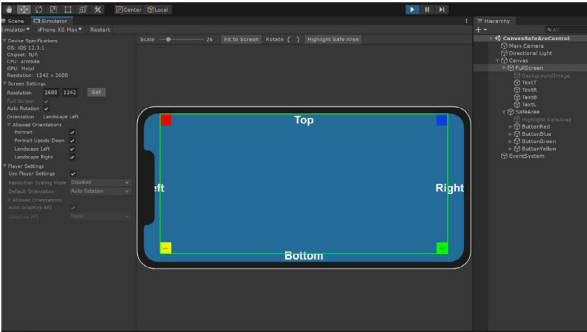

The Device Simulator

The Device Simulator is intended primarily for viewing the layout of your application and testing basic interactions.

Note that the Device Simulator view does not simulate the performance or rendering characteristics of a device, such as processor speed or available RAM.

Watch [Simulate your Game with Device Simulator in Unity](https://www.youtube.com/watch?v=uokF9CmUs9c) to get started.

### <span id="page-53-0"></span>**Input**

Unity has two main systems for handling input, the Input System from the Package Manager and the built-in Input class.

#### <span id="page-53-1"></span>**Input System**

The [Input System](https://unity.com/features/input-system) is focused on ease of use, flexibility, and consistency across devices and platforms. It replaces the built-in Input class.

While you can still get input directly from a device, the Input System shines when you create a series of indirect actions to drive player interaction. Then you can create an [actionMap,](https://docs.unity3d.com/Packages/com.unity.inputsystem@1.0/api/UnityEngine.InputSystem.InputActionMap.html?utm_source=demand-gen&utm_medium=pdf&utm_campaign=asset-links-gmg-choose-unity-for-multiplatform&utm_content=game-dev-field-guide-ebook) a collection of bindings and actions. The action map can then relate those actions to the actual devices.


The Input System is available via the Package Manager.

If you want to adapt the input to more devices, you create more action maps rather than hard coding specific device buttons, keyboard keys, etc. Set up your callbacks and actions just once, then add additional mappings later to support more devices.

Action maps also assist with switching input depending on your in-game context. For example, your player input can behave differently when driving a vehicle versus walking or running.

Be sure to check out the Input System [Quick start guide,](https://docs.unity3d.com/Packages/com.unity.inputsystem@1.0/manual/QuickStartGuide.html?utm_source=demand-gen&utm_medium=pdf&utm_campaign=asset-links-gmg-choose-unity-for-multiplatform&utm_content=game-dev-field-guide-ebook) and install some of the samples available through the Package Manager.

#### <span id="page-53-2"></span>**Built-in input class**

You can alternatively use the original built-in Input class. This lets you utilize the [Input Manager](https://docs.unity3d.com/Manual/ConventionalGameInput.html?utm_source=demand-gen&utm_medium=pdf&utm_campaign=asset-links-gmg-choose-unity-for-multiplatform&utm_content=game-dev-field-guide-ebook) (**Edit > Project Settings > Input Manager**) to set up virtual axes for your keys, buttons, and other input devices. It also supports multitouch and accelerometer data on mobile devices.

Note that enabling the Input System package (above) disables this built-in Input Manager.

| . .<br>C                                | Project Settings                      |                                                                                                    |  |
|-----------------------------------------|---------------------------------------|----------------------------------------------------------------------------------------------------|--|
| Project Settings                        |                                       |                                                                                                    |  |
|                                         | a                                     |                                                                                                    |  |
| Adaptive Performance<br>Audio           | Input Manager                         |                                                                                                    |  |
| Editor<br>Graphics                      | the new Input System Package instead. | This is where you can configure the controls to use with the UnityEngine.Input API. Consider using |  |
| HDRP Default Settings<br>Input Manager  | V Axes                                |                                                                                                    |  |
| Package Manager                         | Size                                  | 35                                                                                                 |  |
| Physics                                 | T Horizontal                          |                                                                                                    |  |
| Physics 2D                              | Name                                  | Horizontal                                                                                         |  |
| Player<br>Preset Manager                | Descriptive Name                      |                                                                                                    |  |
| ▼ Quality                               | Descriptive Negative Name             |                                                                                                    |  |
| HORP                                    | Negative Button                       | left                                                                                               |  |
| Scene Template                          | Positive Button                       | right                                                                                              |  |
| Script Execution Order<br>Services<br>V | Alt Negative Button                   | a                                                                                                  |  |
| Ads<br>Analytics                        | Alt Positive Button                   | d                                                                                                  |  |
|                                         | Gravity                               | 3                                                                                                  |  |
| Cloud Build                             | Dead                                  | 0.001                                                                                              |  |
| Cloud Diagnostics<br>Collaborate        | Sensitivity                           | 3                                                                                                  |  |
| In-App Purchasing                       | Snap                                  | >                                                                                                  |  |
| Tags and Layers                         | Invert                                |                                                                                                    |  |
| TextMesh Pro                            | Type                                  | Key or Mouse Button                                                                                |  |
| Time<br>Timeline                        | Axis                                  | X axis<br>▶                                                                                        |  |
| Version Control                         | Joy Num                               | Get Motion from all Joysticks<br>>                                                                 |  |
| VFX                                     | > Vertical                            |                                                                                                    |  |
| XR Plugin Management                    | > Fire1                               |                                                                                                    |  |
|                                         | > Fire2                               |                                                                                                    |  |

The built-in Input Manager

Here are some useful classes and methods for input:

| Input               | Used to read the axes set up in the Conventional<br>Game Input and access multitouch/accelerometer<br>data on mobile devices                                                                                                      |
|---------------------|-----------------------------------------------------------------------------------------------------------------------------------------------------------------------------------------------------------------------------------|
| Input.GetAxis       | Returns the smoothed value for the virtual axis<br>identified by axisName (value between -1 and 1 for<br>keyboard/joystick devices); for a mouse device,<br>returns the current mouse delta multiplied by the axis<br>sensitivity |
| Input.GetAxisRaw    | Like Input.GetAxis without the smoothing filter                                                                                                                                                                                   |
| Input.GetButton     | Returns true while the virtual button identified by<br>buttonName is held down                                                                                                                                                    |
| Input.GetButtonDown | Returns true during the frame the user pressed down<br>the virtual button identified by buttonName                                                                                                                                |
| Input.GetKey        | Returns true while the user holds down the key<br>identified by name                                                                                                                                                              |
| Input.GetKeyDown    | Returns true during the frame the user starts pressing<br>down the key identified by name                                                                                                                                         |
| Input.touches       | A read-only list of objects representing status of all<br>touches during the last frame                                                                                                                                           |
| Touch               | Structure describing the status of a finger touching<br>the screen                                                                                                                                                                |
| KeyCode             | Lists all of the key press, mouse and joystick options                                                                                                                                                                            |

For an overview of the built-in Input system, see the [Input](https://docs.unity3d.com/ScriptReference/Input.html?utm_source=demand-gen&utm_medium=pdf&utm_campaign=asset-links-gmg-choose-unity-for-multiplatform&utm_content=game-dev-field-guide-ebook) Manual page.

### <span id="page-55-0"></span>**User interface**

Unity implements several UI systems for either your in-game user interface or for Editor scripts. You may tap one or more of these, depending on your use case.

#### <span id="page-55-1"></span>**Unity GUI**

[Unity UI](https://docs.unity3d.com/2020.3/Documentation/Manual/UISystem.html?utm_source=demand-gen&utm_medium=pdf&utm_campaign=asset-links-gmg-choose-unity-for-multiplatform&utm_content=game-dev-field-guide-ebook) (sometimes referred to as UGUI) offers a GameObject-based approach for editing and positioning UI elements. Unity UI is a system for developing user interfaces for games and applications. It uses components and the Game view to arrange, position, and style user interfaces. You cannot use Unity UI to create or change user interfaces in the Unity Editor.

The [Unity UI guide](https://docs.unity3d.com/Packages/com.unity.ugui@1.0/manual/index.html?utm_source=demand-gen&utm_medium=pdf&utm_campaign=asset-links-gmg-choose-unity-for-multiplatform&utm_content=game-dev-field-guide-ebook) covers how to lay out your UI elements and create interactions.

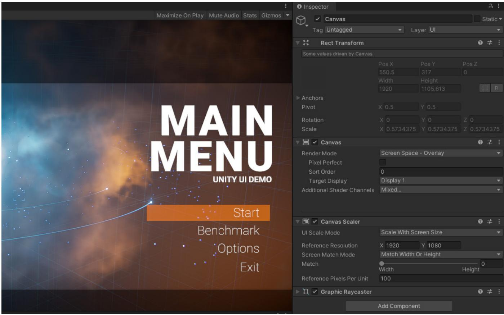

Unity UI offers a GameObject-based approach for UI elements.

#### <span id="page-56-0"></span>**Immediate Mode GUI**

[Immediate Mode GUI](https://docs.unity3d.com/2020.3/Documentation/Manual/GUIScriptingGuide.html?utm_source=demand-gen&utm_medium=pdf&utm_campaign=asset-links-gmg-choose-unity-for-multiplatform&utm_content=game-dev-field-guide-ebook) (IMGUI) can help you build custom inspectors and Editor windows. To create IMGUI elements, you write code within a special MonoBehaviour function named [OnGUI](https://docs.unity3d.com/ScriptReference/MonoBehaviour.OnGUI.html?utm_source=demand-gen&utm_medium=pdf&utm_campaign=asset-links-gmg-choose-unity-for-multiplatform&utm_content=game-dev-field-guide-ebook). This system is not generally intended for normal in-game user interfaces.

The code displays the interface in "immediate mode," executed every frame. There are no persistent GameObjects other than the object where your OnGUI code is attached. The code produces GUI controls that are drawn and handled with a single function call.

Follow [this scripting guide](https://docs.unity3d.com/2020.3/Documentation/Manual/GUIScriptingGuide.html?utm_source=demand-gen&utm_medium=pdf&utm_campaign=asset-links-gmg-choose-unity-for-multiplatform&utm_content=game-dev-field-guide-ebook) for when you need IMGUI.

An Editor UI created with Immediate Mode GUI

### <span id="page-57-0"></span>**Profiling and optimization**

Once you've designed a great game, your next task is to make it fast. Unity includes a suite of profiling and optimization tools to help you maximize the available resources for your target platform.

#### <span id="page-57-1"></span>**Unity Profiler**

The Unity Profiler gives you performance information about the application. For best results, run it on the end platform where you intend to publish your build. This gives you accurate timings about what impacts the performance of your application.

The Profiler can also work directly from the Editor in Play mode. Just be aware that this setup sacrifices accuracy, so it's useful as a quick check but not for a final assessment.

The Profiler can help you identify areas for potential improvement in your application: the CPU, GPU, memory, renderer, physics, and audio. Iterate on those areas. You can pinpoint things like how your code, assets, scene settings, camera rendering, and build settings affect how well your application runs.

The Profiler displays the results in a series of graphs so you can visualize where spikes happen.

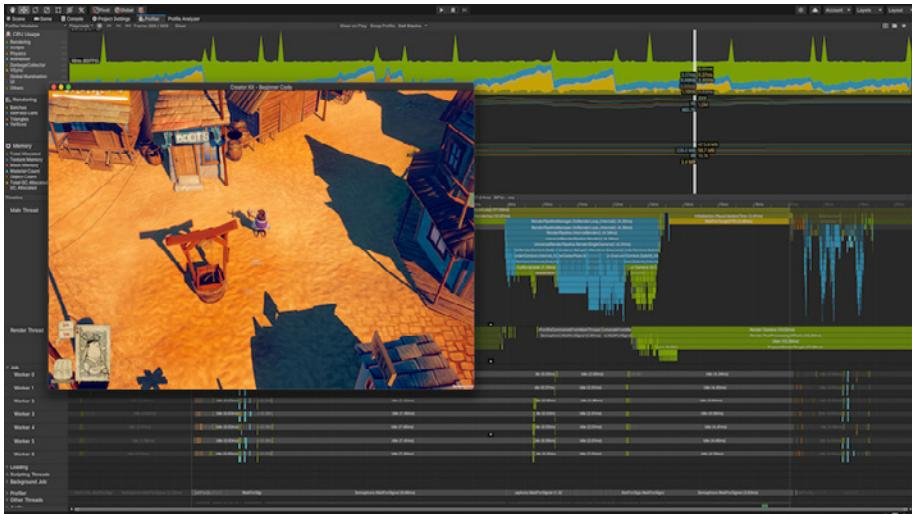

The Unity Profiler

Unity provides a number of Profiler markers to give you insight into what is taking up time in your application. The [ProfilerRecorder](https://docs.unity3d.com/ScriptReference/Unity.Profiling.ProfilerRecorder.html?utm_source=demand-gen&utm_medium=pdf&utm_campaign=asset-links-gmg-choose-unity-for-multiplatform&utm_content=game-dev-field-guide-ebook) can also use these markers to get useful timings for your frame.

Here are some of the most common markers:

| Profiler marker                | Summary                                                                                                                                                               |
|--------------------------------|-----------------------------------------------------------------------------------------------------------------------------------------------------------------------|
| Main thread base markers       | Markers on the main thread containing<br>samples from the main game loop, PlayerLoop,<br>as well as the EditorLoop (present when you<br>profile inside of the Editor) |
| Script update markers          | Contain samples of MonoBehaviour.Update<br>methods (Update/FixedUpdate/LateUpdate)<br>and coroutines                                                                  |
| Rendering and VSync<br>markers | Contain the samples where the CPU spends<br>time processing data for the GPU, or where it<br>might be waiting for the GPU to finish                                   |
| Back end scripting markers     | Highlight Mono or IL2CPP scripting backend<br>activities and can be useful for troubleshooting<br>issues with garbage collection and allocation                       |
| Multithreading markers         | Contain samples that do not measure the<br>CPU cycles consumed, instead highlighting<br>information that relates to thread<br>synchronization and the Job System      |
| Physics markers                | Include high-level physics Profiler markers<br>that sample Physics.Contacts, Physics.<br>TriggerEnterExits, Physics.UpdateBodies, etc.                                |
| Performance warnings           | Displayed when the Profiler detects some<br>specific calls that you should avoid in<br>performance-critical contexts                                                  |

To access the Profiler window, navigate to the menu: **Window > Analysis > Profiler**. For a detailed overview of the window, see the [Profiler window](https://docs.unity3d.com/Manual/ProfilerWindow.html?utm_source=demand-gen&utm_medium=pdf&utm_campaign=asset-links-gmg-choose-unity-for-multiplatform&utm_content=game-dev-field-guide-ebook) documentation.

#### <span id="page-58-0"></span>**Memory Profiler**

The [Memory Profiler](https://docs.unity3d.com/Packages/com.unity.memoryprofiler@0.2/manual/index.html?utm_source=demand-gen&utm_medium=pdf&utm_campaign=asset-links-gmg-choose-unity-for-multiplatform&utm_content=game-dev-field-guide-ebook) is a tool you can use to identify areas in your Unity project and the Unity Editor where you can reduce memory usage. It gives you an overview of native and managed memory allocations, as well as the references between them that keep them in memory.

Use the Memory Profiler to capture, inspect, and compare memory snapshots to detect memory leaks and fragmentation.

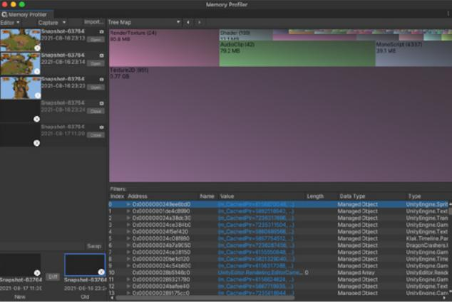

The Memory Profiler main view in tree map view

#### <span id="page-59-0"></span>**Profile Analyzer**

The [Profile Analyzer](https://docs.unity3d.com/Packages/com.unity.performance.profile-analyzer@1.0/manual/index.html?utm_source=demand-gen&utm_medium=pdf&utm_campaign=asset-links-gmg-choose-unity-for-multiplatform&utm_content=game-dev-field-guide-ebook) aggregates and visualizes frame and marker data from a set of [Unity Profiler](https://docs.unity3d.com/Manual/Profiler.html?utm_source=demand-gen&utm_medium=pdf&utm_campaign=asset-links-gmg-choose-unity-for-multiplatform&utm_content=game-dev-field-guide-ebook) frames to help you understand their behavior. You can use the Profile Analyzer to compare two sets of data side-by-side, complementing the single-frame analysis already available in the Unity Profiler.

For information on how to use the Profile Analyzer, see the window's [documentation.](https://docs.unity3d.com/Packages/com.unity.performance.profile-analyzer@1.0/manual/profile-analyzer-window.html?utm_source=demand-gen&utm_medium=pdf&utm_campaign=asset-links-gmg-choose-unity-for-multiplatform&utm_content=game-dev-field-guide-ebook)

The Profile Analyzer

For a better understanding on optimization in Unity for mobile platforms, see this blog post, [Optimize your mobile game performance.](https://blog.unity.com/technology/optimize-your-mobile-game-performance-tips-on-profiling-memory-and-code-architecture?utm_source=demand-gen&utm_medium=pdf&utm_campaign=asset-links-gmg-choose-unity-for-multiplatform&utm_content=game-dev-field-guide-ebook) You can also download the [full e-book](https://create.unity3d.com/optimize-mobile-game-eBook?utm_source=demand-gen&utm_medium=pdf&utm_campaign=asset-links-gmg-choose-unity-for-multiplatform&utm_content=game-dev-field-guide-ebook) outlining Unity experts' optimization tips for mobile games.

### <span id="page-60-0"></span>**Debugging and playtesting**

Unity is an excellent tool for tweaking and debugging. At any time, you can enter Editor Play mode and see all of the gameplay variables while the application runs in the Editor.

In Play mode, the Game view gives you a preview of your final, published application. You can alter the Unity scene on the fly and experiment, pausing any time or stepping through the code one statement at a time.

To assist with playtesting, you'll likely create cheats that will allow you to:

- Unlock levels, characters, items, etc.
- Disable enemies and/or gameplay
- Toggle GUIs
- Grant invincibility
- Add/subtract time, money, collectibles, etc.

### <span id="page-60-1"></span>**Debugging gameplay**

Playtesting isn't an exact science, but consider these suggestions:

- Implement shortcuts for printing the player's world position. This helps you determine whether specific bugs happen at a particular place in the level.
- For small teams, make a test Prefab for each team member, and read settings and debug options from an uncommitted file. This way, team members won't accidentally commit testing options or change the production scene.
- Maintain a test/sandbox scene with all gameplay elements. For instance, create a scene with all enemies, all objects you can interact with, etc. This makes it easy to test functionality without having to play through the entire game.
- Write a set of in-Editor cheats. Attach a [MenuItem](https://docs.unity3d.com/ScriptReference/MenuItem.html?utm_source=demand-gen&utm_medium=pdf&utm_campaign=asset-links-gmg-choose-unity-for-multiplatform&utm_content=game-dev-field-guide-ebook) attribute to a static method that can check if the [Application.isPlaying](https://docs.unity3d.com/ScriptReference/Application-isPlaying.html?utm_source=demand-gen&utm_medium=pdf&utm_campaign=asset-links-gmg-choose-unity-for-multiplatform&utm_content=game-dev-field-guide-ebook), and then run some logic.

#### <span id="page-61-0"></span>**Additional debugging tips**

Unity also includes a [Debug](https://docs.unity3d.com/Manual/class-Debug.html?utm_source=demand-gen&utm_medium=pdf&utm_campaign=asset-links-gmg-choose-unity-for-multiplatform&utm_content=game-dev-field-guide-ebook) class to help you visualize information in the Editor while it's running. Use this to print messages or warnings into the [Console](https://docs.unity3d.com/Manual/Console.html?utm_source=demand-gen&utm_medium=pdf&utm_campaign=asset-links-gmg-choose-unity-for-multiplatform&utm_content=game-dev-field-guide-ebook)  [window,](https://docs.unity3d.com/Manual/Console.html?utm_source=demand-gen&utm_medium=pdf&utm_campaign=asset-links-gmg-choose-unity-for-multiplatform&utm_content=game-dev-field-guide-ebook) which shows errors, warnings, and other messages generated by Unity.

You can also use Debug to draw visualization lines in the Scene view and Game view, as well as to pause Editor Play mode from a script.

- Pausing execution with **[Debug.Break](https://docs.unity3d.com/ScriptReference/Debug.Break.html?utm_source=demand-gen&utm_medium=pdf&utm_campaign=asset-links-gmg-choose-unity-for-multiplatform&utm_content=game-dev-field-guide-ebook)** is useful if you want to check certain values in the Inspector when the application is difficult to pause manually.
- You can format your Console messages with different degrees of severity using **[Debug.Log](https://docs.unity3d.com/ScriptReference/Debug.Log.html?utm_source=demand-gen&utm_medium=pdf&utm_campaign=asset-links-gmg-choose-unity-for-multiplatform&utm_content=game-dev-field-guide-ebook)**, **[Debug.LogWarning](https://docs.unity3d.com/ScriptReference/Debug.LogWarning.html?utm_source=demand-gen&utm_medium=pdf&utm_campaign=asset-links-gmg-choose-unity-for-multiplatform&utm_content=game-dev-field-guide-ebook)**, and **[Debug.LogError](https://docs.unity3d.com/ScriptReference/Debug.LogError.html?utm_source=demand-gen&utm_medium=pdf&utm_campaign=asset-links-gmg-choose-unity-for-multiplatform&utm_content=game-dev-field-guide-ebook)**.


Log messages, warnings, and errors in the Console

- When using **[Debug.Log](https://docs.unity3d.com/ScriptReference/Debug.Log.html?utm_source=demand-gen&utm_medium=pdf&utm_campaign=asset-links-gmg-choose-unity-for-multiplatform&utm_content=improving-workflows-unity-2020-lts-ebook)**, you can pass in an object as the context. If you click on the message in the Console, Unity highlights the GameObject in the Hierarchy window.
- Use [Rich Text](https://docs.unity3d.com/Packages/com.unity.ugui@1.0/manual/StyledText.html?utm_source=demand-gen&utm_medium=pdf&utm_campaign=asset-links-gmg-choose-unity-for-multiplatform&utm_content=game-dev-field-guide-ebook) to mark up your **[Debug.Log](https://docs.unity3d.com/ScriptReference/Debug.Log.html?utm_source=demand-gen&utm_medium=pdf&utm_campaign=asset-links-gmg-choose-unity-for-multiplatform&utm_content=improving-workflows-unity-2020-lts-ebook)** statements. This can help you enhance error reports in the Console.
- Troubleshooting physics? **[Debug.DrawLine](https://docs.unity3d.com/ScriptReference/Debug.DrawLine.html?utm_source=demand-gen&utm_medium=pdf&utm_campaign=asset-links-gmg-choose-unity-for-multiplatform&utm_content=game-dev-field-guide-ebook)** and **[Debug.DrawRay](https://docs.unity3d.com/ScriptReference/Debug.DrawRay.html?utm_source=demand-gen&utm_medium=pdf&utm_campaign=asset-links-gmg-choose-unity-for-multiplatform&utm_content=game-dev-field-guide-ebook)** can help you visualize ray casting.

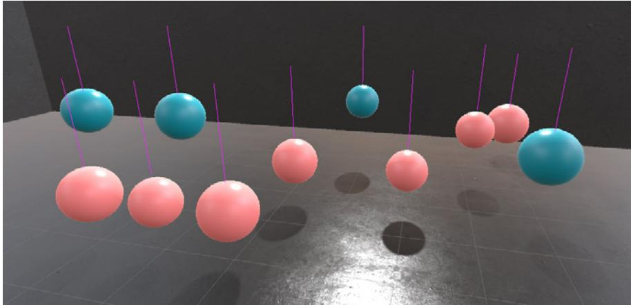

Debug.DrawLine

#### <span id="page-62-0"></span>**Unity Test Framework (UTF)**

The [Unity Test Framework](https://docs.unity3d.com/Packages/com.unity.test-framework@1.1/manual/index.html?utm_source=demand-gen&utm_medium=pdf&utm_campaign=asset-links-gmg-choose-unity-for-multiplatform&utm_content=game-dev-field-guide-ebook) (formerly known as the Unity Test Runner) allows you to create automated tests to make sure your code runs as intended. Create unit tests for any logical snippet of code and apply [test-driven development](https://en.wikipedia.org/wiki/Test-driven_development) while you develop the project.

UTF enables you to test your code in both Edit mode and Play mode. You can also run your tests on target builds such as [Standalone,](https://docs.unity3d.com/Manual/Standalone.html?utm_source=demand-gen&utm_medium=pdf&utm_campaign=asset-links-gmg-choose-unity-for-multiplatform&utm_content=game-dev-field-guide-ebook) Android, iOS, and more. UTF extends the [NUnit library,](http://www.nunit.org/) an open-source unit testing library for .NET languages.

To open the Test Framework, go to **Window > General > Test Runner**. Follow the instructions to set up a work folder and assembly definition, then add unit tests to your Test Assembly. This process can help you to isolate bugs faster and learn to write a testable way.

For more information about the Test Framework, see the [Performance](https://blog.unity.com/technology/performance-benchmarking-in-unity-how-to-get-started?utm_source=demand-gen&utm_medium=pdf&utm_campaign=asset-links-gmg-choose-unity-for-multiplatform&utm_content=game-dev-field-guide-ebook)  [Benchmarking in Unity](https://blog.unity.com/technology/performance-benchmarking-in-unity-how-to-get-started?utm_source=demand-gen&utm_medium=pdf&utm_campaign=asset-links-gmg-choose-unity-for-multiplatform&utm_content=game-dev-field-guide-ebook) blog post and the [Unity Test Framework](https://docs.unity3d.com/Packages/com.unity.test-framework@1.1/manual/index.html?utm_source=demand-gen&utm_medium=pdf&utm_campaign=asset-links-gmg-choose-unity-for-multiplatform&utm_content=game-dev-field-guide-ebook) documentation.

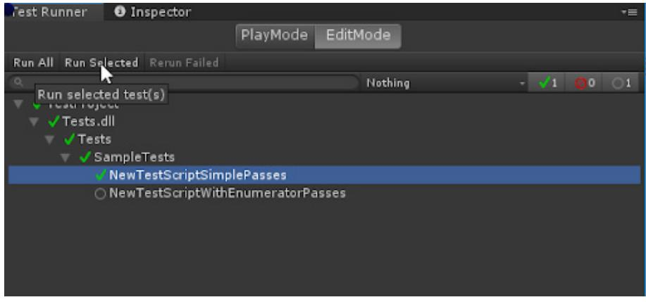

Unity Test Framework

### <span id="page-63-0"></span>**Particle effects**

Unity includes two particle simulation solutions for your effects needs (smoke, liquids, flames):

— The **[Particle System](https://docs.unity3d.com/Manual/Built-inParticleSystem.html?utm_source=demand-gen&utm_medium=pdf&utm_campaign=asset-links-gmg-choose-unity-for-multiplatform&utm_content=game-dev-field-guide-ebook)** can simulate thousands of particles on the CPU. Use the modules of the Particle System component to represent predefined behaviors. To create each effect, you will often layer several GameObjects with ParticleSystems together.

ParticleSystem supports the Built-in Render Pipeline and URP. You can access the [ParticleSystem class](https://docs.unity3d.com/ScriptReference/ParticleSystem.html?utm_source=demand-gen&utm_medium=pdf&utm_campaign=asset-links-gmg-choose-unity-for-multiplatform&utm_content=game-dev-field-guide-ebook) to define a system and its individual particles via script.

Particle Systems can interact with Unity's underlying physics system and any Colliders in your scene, but cannot access frame buffers.

For examples of the built-in ParticleSystem, download the [Particle Pack](https://assetstore.unity.com/packages/essentials/tutorial-projects/unity-particle-pack-127325?utm_source=demand-gen&utm_medium=pdf&utm_campaign=asset-links-gmg-choose-unity-for-multiplatform&utm_content=game-dev-field-guide-ebook) from the Asset Store.

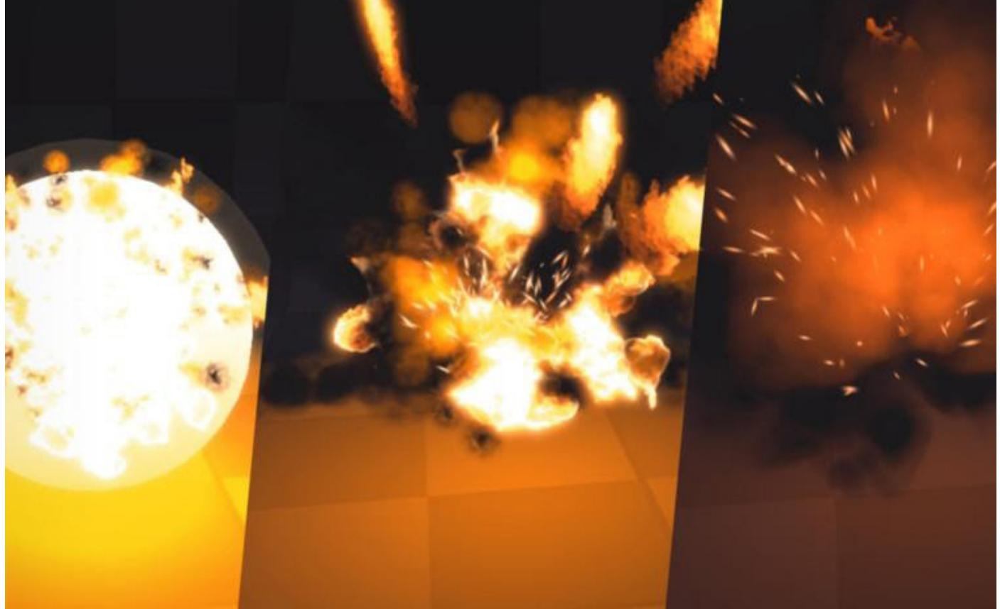

A simple effects simulation using the Particle System

— The **[Visual Effect Graph](https://docs.unity3d.com/Manual/VFXGraph.html?utm_source=demand-gen&utm_medium=pdf&utm_campaign=asset-links-gmg-choose-unity-for-multiplatform&utm_content=game-dev-field-guide-ebook)** moves calculations on the GPU using compute shaders. This can simulate millions of particles that can also interact with the color and depth buffer.

The workflow includes a highly customizable graph view.

While it does not have access to the underlying physics system, a Visual Effect Graph can interact with complex assets such as Point Caches, Vector Fields, and Signed Distance Fields.

Visual Effect Graph only works on [platforms that support compute shaders](https://docs.unity3d.com/Manual/class-ComputeShader.html?utm_source=demand-gen&utm_medium=pdf&utm_campaign=asset-links-gmg-choose-unity-for-multiplatform&utm_content=game-dev-field-guide-ebook) and HDRP (support for URP is currently in Preview). You can use the [event interface](https://docs.unity3d.com/Packages/com.unity.visualeffectgraph@latest/index.html?subfolder=/manual/Events.html?utm_source=demand-gen&utm_medium=pdf&utm_campaign=asset-links-gmg-choose-unity-for-multiplatform&utm_content=game-dev-field-guide-ebook) to send custom events and pass in attached data that the graph can process. The [Visual Effect component](https://docs.unity3d.com/Packages/com.unity.visualeffectgraph@latest/index.html?subfolder=/manual/VisualEffectComponent.html?utm_source=demand-gen&utm_medium=pdf&utm_campaign=asset-links-gmg-choose-unity-for-multiplatform&utm_content=game-dev-field-guide-ebook) also provides a playback control API.

Unity maintains two GitHub projects that demonstrate production examples of the Visual Effect Graph, the [Visual Effect Graph Samples](https://github.com/Unity-Technologies/VisualEffectGraph-Samples) project and the [Spaceship Demo.](https://github.com/Unity-Technologies/SpaceshipDemo) These both illustrate how the Visual Effect Graph can create a myriad of high-quality effects.

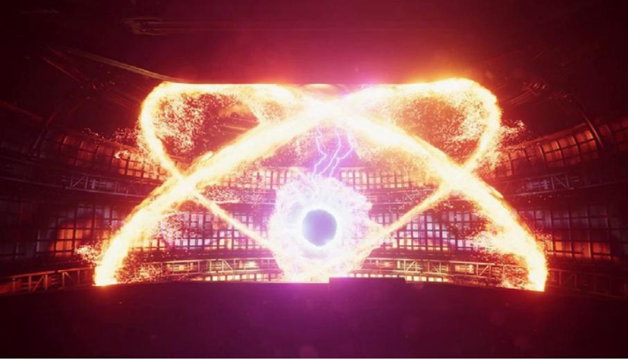

Millions of particles onscreen created with the Visual Effect Graph

When selecting one of the two systems, keep device compatibility in mind. Most PCs and consoles support [compute shaders,](https://docs.unity3d.com/Manual/class-ComputeShader.html?utm_source=demand-gen&utm_medium=pdf&utm_campaign=asset-links-gmg-choose-unity-for-multiplatform&utm_content=optimize-game-performance-2020-lts-ebook?utm_source=demand-gen&utm_medium=pdf&utm_campaign=asset-links-gmg-choose-unity-for-multiplatform&utm_content=game-dev-field-guide-ebook) but many mobile devices do not. We currently recommend the built-in ParticleSystem if your intended platform is mobile. If your target platform does support compute shaders, Unity allows you to use both types of particle simulation in your project.

### <span id="page-65-0"></span>**Physics**

Unity implements the [NVIDIA PhysX engine](https://en.wikipedia.org/wiki/PhysX) for 3D projects and a [2D engine f](https://docs.unity3d.com/2020.1/Documentation/Manual/Physics2DReference.html?utm_source=demand-gen&utm_medium=pdf&utm_campaign=asset-links-gmg-choose-unity-for-multiplatform&utm_content=game-dev-field-guide-ebook)or 2D projects. The built-in physics engine in Unity provides industry standard solutions for [Rigidbody](https://docs.unity3d.com/Manual/RigidbodiesOverview.html?utm_source=demand-gen&utm_medium=pdf&utm_campaign=asset-links-gmg-choose-unity-for-multiplatform&utm_content=game-dev-field-guide-ebook) interactions, joints, and forces. Use the [Physics API](https://docs.unity3d.com/Manual/PhysicsSection.html?utm_source=demand-gen&utm_medium=pdf&utm_campaign=asset-links-gmg-choose-unity-for-multiplatform&utm_content=game-dev-field-guide-ebook) for methods to ray cast or shape cast, test overlaps, and handle triggers/collisions.

#### <span id="page-65-1"></span>**3D physics**

Unity's built-in physics engine includes several useful components:

- **[Rigidbody](https://docs.unity3d.com/Manual/RigidbodiesOverview.html?utm_source=demand-gen&utm_medium=pdf&utm_campaign=asset-links-gmg-choose-unity-for-multiplatform&utm_content=game-dev-field-guide-ebook)** allows the physics engine to control movement of the object. A Rigidbody will fall with gravity, and you can apply force or torque to it using the supplied methods. If a Collider component is active, the underlying GameObject will respond to physics collisions.
- **[Colliders](https://docs.unity3d.com/Manual/CollidersOverview.html?utm_source=demand-gen&utm_medium=pdf&utm_campaign=asset-links-gmg-choose-unity-for-multiplatform&utm_content=game-dev-field-guide-ebook)** [\(Box Collider,](https://docs.unity3d.com/Manual/class-BoxCollider.html?utm_source=demand-gen&utm_medium=pdf&utm_campaign=asset-links-gmg-choose-unity-for-multiplatform&utm_content=game-dev-field-guide-ebook) [Sphere Collider](https://docs.unity3d.com/Manual/class-SphereCollider.html?utm_source=demand-gen&utm_medium=pdf&utm_campaign=asset-links-gmg-choose-unity-for-multiplatform&utm_content=game-dev-field-guide-ebook), [Capsule Collider](https://docs.unity3d.com/Manual/class-CapsuleCollider.html?utm_source=demand-gen&utm_medium=pdf&utm_campaign=asset-links-gmg-choose-unity-for-multiplatform&utm_content=game-dev-field-guide-ebook), [Mesh Collider\)](https://docs.unity3d.com/Manual/class-MeshCollider.html?utm_source=demand-gen&utm_medium=pdf&utm_campaign=asset-links-gmg-choose-unity-for-multiplatform&utm_content=game-dev-field-guide-ebook) represent primitive or mesh volumes that define the boundaries for physics collisions.
- **[Joints](https://docs.unity3d.com/Manual/Joints.html?utm_source=demand-gen&utm_medium=pdf&utm_campaign=asset-links-gmg-choose-unity-for-multiplatform&utm_content=game-dev-field-guide-ebook)** ([Fixed Joint](https://docs.unity3d.com/Manual/class-FixedJoint.html?utm_source=demand-gen&utm_medium=pdf&utm_campaign=asset-links-gmg-choose-unity-for-multiplatform&utm_content=game-dev-field-guide-ebook), [Hinge Joint](https://docs.unity3d.com/Manual/class-HingeJoint.html?utm_source=demand-gen&utm_medium=pdf&utm_campaign=asset-links-gmg-choose-unity-for-multiplatform&utm_content=game-dev-field-guide-ebook), [Spring Joint](https://docs.unity3d.com/Manual/class-SpringJoint.html?utm_source=demand-gen&utm_medium=pdf&utm_campaign=asset-links-gmg-choose-unity-for-multiplatform&utm_content=game-dev-field-guide-ebook), [Character Joint\)](https://docs.unity3d.com/Manual/class-CharacterJoint.html?utm_source=demand-gen&utm_medium=pdf&utm_campaign=asset-links-gmg-choose-unity-for-multiplatform&utm_content=game-dev-field-guide-ebook) allows you to connect two Rigidbody components to model a variety of motion constraints (e.g., breakable joint, one axis of rotation, elastic joint, ball and socket, etc.).
- **[CharacterController](https://docs.unity3d.com/ScriptReference/CharacterController.html?utm_source=demand-gen&utm_medium=pdf&utm_campaign=asset-links-gmg-choose-unity-for-multiplatform&utm_content=game-dev-field-guide-ebook)** allows you to handle movement constrained by collisions without requiring a Rigidbody.

The Rigidbody component features [speculative](https://docs.unity3d.com/Manual/ContinuousCollisionDetection.html#speculative?utm_source=demand-gen&utm_medium=pdf&utm_campaign=asset-links-gmg-choose-unity-for-multiplatform&utm_content=game-dev-field-guide-ebook) and [sweep-based continuous](https://docs.unity3d.com/Manual/ContinuousCollisionDetection.html#sweep?utm_source=demand-gen&utm_medium=pdf&utm_campaign=asset-links-gmg-choose-unity-for-multiplatform&utm_content=game-dev-field-guide-ebook)  [collision detection](https://docs.unity3d.com/Manual/ContinuousCollisionDetection.html#sweep?utm_source=demand-gen&utm_medium=pdf&utm_campaign=asset-links-gmg-choose-unity-for-multiplatform&utm_content=game-dev-field-guide-ebook) for fast-moving objects.

Use [multiphysics scenes](https://docs.unity3d.com/Manual/physics-multi-scene.html?utm_source=demand-gen&utm_medium=pdf&utm_campaign=asset-links-gmg-choose-unity-for-multiplatform&utm_content=game-dev-field-guide-ebook) to manage or work around complex physics contexts. For example, you could simulate multiple physics scenes in order to predict GameObject collisions and trajectories.


Use multiple scenes to predict collisions or trajectories.

Unity also provides a [Debug Visualization](https://docs.unity3d.com/Manual/PhysicsDebugVisualization.html?utm_source=demand-gen&utm_medium=pdf&utm_campaign=asset-links-gmg-choose-unity-for-multiplatform&utm_content=game-dev-field-guide-ebook) window (**Window > Analysis >** 

**Physics Debugger**), an interface that allows you to color and toggle physics components by category. This helps quickly troubleshoot Colliders or other physics-based scenarios in your scene.


The Physics Debugger window

Apply physics updates inside of MonoBehaviour's [FixedUpdate](https://docs.unity3d.com/ScriptReference/MonoBehaviour.FixedUpdate.html?utm_source=demand-gen&utm_medium=pdf&utm_campaign=asset-links-gmg-choose-unity-for-multiplatform&utm_content=game-dev-field-guide-ebook) method, which is called on a fixed time step.The [Physics](https://docs.unity3d.com/ScriptReference/Physics.html?utm_source=demand-gen&utm_medium=pdf&utm_campaign=asset-links-gmg-choose-unity-for-multiplatform&utm_content=game-dev-field-guide-ebook) class includes several static methods that you will use for physics interactions. Unity also provides several physics events on the [Collider](https://docs.unity3d.com/ScriptReference/Collider.html?utm_source=demand-gen&utm_medium=pdf&utm_campaign=asset-links-gmg-choose-unity-for-multiplatform&utm_content=game-dev-field-guide-ebook) class to handle collisions and triggers. The following are some of the methods that you will use for common physics interactions.

| Classes/Methods                                                                                         | Description                                                                                                                                                                                    |
|---------------------------------------------------------------------------------------------------------|------------------------------------------------------------------------------------------------------------------------------------------------------------------------------------------------|
| Monobehaviour.FixedUpdate                                                                               | Message for physics calculations updates<br>on a fixed frame-rate determined by Edit ><br>Settings > Time > Fixed Timestep                                                                     |
| Physics.Raycast,<br>Physics.Linecast,<br>Physics.BoxCast,<br>Physics.CapsuleCast,<br>Physics.SphereCast | Methods for determining if a collider falls<br>within a ray, line, or shape                                                                                                                    |
| Physics.OverlapBox,<br>Physics OverlapSphere,<br>Physics OverlapCapsule                                 | Methods for testing whether a collider falls<br>within a given shape                                                                                                                           |
| Collider.OnCollisionEnter,<br>Collider.OnCollisionStay,<br>Collider.OnCollisionExit                     | Messages sent when an incoming collider<br>makes contact/stays in contact/leaves contact<br>with this object's collider                                                                        |
| Collider.OnTriggerEnter,<br>Collider.OnTriggerStay,<br>Collider.OnTriggerExit                           | Messages sent when an incoming trigger makes<br>contact/stays in contact/leaves contact with this<br>object's collider (a trigger does not register an<br>actual collision but sends messages) |

#### <span id="page-67-0"></span>**2D physics**

Unity has a separate physics engine optimized for handling 2D physics. Most 2D physics components are simply "flattened" versions of the 3D equivalents.

The corresponding components have "2D" appended to the name, e.g., [Physics2D,](https://docs.unity3d.com/ScriptReference/Physics2D.html?utm_source=demand-gen&utm_medium=pdf&utm_campaign=asset-links-gmg-choose-unity-for-multiplatform&utm_content=game-dev-field-guide-ebook) [Rigidbody2D,](https://docs.unity3d.com/ScriptReference/Rigidbody2D.html?utm_source=demand-gen&utm_medium=pdf&utm_campaign=asset-links-gmg-choose-unity-for-multiplatform&utm_content=game-dev-field-guide-ebook) [Collider2D,](https://docs.unity3d.com/ScriptReference/Collider2D.html?utm_source=demand-gen&utm_medium=pdf&utm_campaign=asset-links-gmg-choose-unity-for-multiplatform&utm_content=game-dev-field-guide-ebook) [Joint2D](https://docs.unity3d.com/ScriptReference/Joint2D.html?utm_source=demand-gen&utm_medium=pdf&utm_campaign=asset-links-gmg-choose-unity-for-multiplatform&utm_content=game-dev-field-guide-ebook), etc. Otherwise, they behave like their analogous 3D classes.

Be sure to download the [PhysicsExamples2D](https://github.com/Unity-Technologies/PhysicsExamples2D?utm_source=YouTube&utm_medium=social&utm_campaign=evangelism_global_generalpromo_2020-08-12_github-physics2dsamples) project for some example use cases, and watch this accompanying [introductory video](https://www.youtube.com/watch?v=Xxbs9x2qB7Y).

Read more about the built-in 3D and 2D physics implementations in the [Physics](https://docs.unity3d.com/Manual/PhysicsSection.html?utm_source=demand-gen&utm_medium=pdf&utm_campaign=asset-links-gmg-choose-unity-for-multiplatform&utm_content=game-dev-field-guide-ebook) documentation. For tips about optimizing 3D physics and its settings, watch [Physics Performance Optimization.](https://www.youtube.com/watch?v=pTz3LMQpvfA)

### <span id="page-68-0"></span>**Audio**

Unity's audio system has sophisticated features for playing sounds in 3D space. Unity can also record audio with any available microphone for use during gameplay or for storage and transmission.

Audio components mimic their real-life counterparts. Attach [AudioSources](https://docs.unity3d.com/ScriptReference/AudioSource.html?utm_source=demand-gen&utm_medium=pdf&utm_campaign=asset-links-gmg-choose-unity-for-multiplatform&utm_content=game-dev-field-guide-ebook) to your GameObjects so they can play back an audio file called an [AudioClip.](https://docs.unity3d.com/ScriptReference/AudioClip.html?utm_source=demand-gen&utm_medium=pdf&utm_campaign=asset-links-gmg-choose-unity-for-multiplatform&utm_content=game-dev-field-guide-ebook) An [AudioListener](https://docs.unity3d.com/ScriptReference/AudioListener.html?utm_source=demand-gen&utm_medium=pdf&utm_campaign=asset-links-gmg-choose-unity-for-multiplatform&utm_content=game-dev-field-guide-ebook) somewhere else in the scene (usually attached to your main Camera) then hears this clip.

In this way, the audio system can replicate the Doppler effect if the source and listener move relative to one another. Simulate other effects, like echoes, using Audio Filters.

An [AudioMixer](https://docs.unity3d.com/ScriptReference/Audio.AudioMixer.html?utm_source=demand-gen&utm_medium=pdf&utm_campaign=asset-links-gmg-choose-unity-for-multiplatform&utm_content=game-dev-field-guide-ebook) blends various audio sources, applies effects to them, and performs mastering.

Caption: The AudioMixer

These are the most common audio component classes.

| Class         | Description                                                                                                                                                                                                                                                       |
|---------------|-------------------------------------------------------------------------------------------------------------------------------------------------------------------------------------------------------------------------------------------------------------------|
| AudioClip     | Any Audio file imported into Unity is available from scripts as an<br>AudioClip. This provides a way for the audio system to access<br>the encoded audio data at runtime. Meta-information from the<br>AudioClip may load even before the actual audio data does. |
| AudioSource   | An AudioSource attached to a GameObject plays back<br>sounds in a 3D environment.                                                                                                                                                                                 |
| AudioListener | An AudioListener represents a microphone-like device that<br>hears all sounds around it. You have one listener per scene.                                                                                                                                         |
| AudioMixer    | An Audio Mixer group is essentially a signal chain which<br>allows you to apply volume attenuation and pitch correction;<br>it allows you process the audio signal with effects and<br>perform mastering.                                                         |

### <span id="page-69-0"></span>**Render pipelines and graphics**

No game is complete without graphics. Before you begin lighting your scenes, you will need to choose between one of the different render pipelines. A render pipeline performs a series of operations that take the contents of a scene to display them on-screen.

#### <span id="page-69-1"></span>**3D pipelines**

Unity provides three prebuilt render pipelines with different capabilities and performance characteristics. You can also create your own.

- The **[Built-in Render Pipeline](https://docs.unity3d.com/Manual/built-in-render-pipeline.html?utm_source=demand-gen&utm_medium=pdf&utm_campaign=asset-links-gmg-choose-unity-for-multiplatform&utm_content=game-dev-field-guide-ebook)** is a general purpose render pipeline with limited customization. This is the default.
- The **[Universal Render Pipeline \(URP\)](https://docs.unity3d.com/Packages/com.unity.render-pipelines.universal@11.0/manual/?utm_source=demand-gen&utm_medium=pdf&utm_campaign=asset-links-gmg-choose-unity-for-multiplatform&utm_content=game-dev-field-guide-ebook)** is a prebuilt [Scriptable Render](https://docs.unity3d.com/Manual/ScriptableRenderPipeline.html?utm_source=demand-gen&utm_medium=pdf&utm_campaign=asset-links-gmg-choose-unity-for-multiplatform&utm_content=game-dev-field-guide-ebook)  [Pipeline](https://docs.unity3d.com/Manual/ScriptableRenderPipeline.html?utm_source=demand-gen&utm_medium=pdf&utm_campaign=asset-links-gmg-choose-unity-for-multiplatform&utm_content=game-dev-field-guide-ebook) (SRP). URP provides artist-friendly workflows to create optimized graphics. Consider URP if you want to target multiple platforms – from mobile to desktop to consoles – with a single Unity project.

URP adds graphics and rendering features unavailable to the Built-in Render Pipeline. In order to maintain performance, it makes tradeoffs to reduce the computational cost of lighting and shading. URP supports and scales to all Unity supported platforms. Choose URP if you want to build for mobile, Nintendo Switch, or Oculus Quest.

— The **[High Definition Render Pipeline \(HDRP\)](https://docs.unity3d.com/Packages/com.unity.render-pipelines.high-definition@11.0/manual/index.html?utm_source=demand-gen&utm_medium=pdf&utm_campaign=asset-links-gmg-choose-unity-for-multiplatform&utm_content=game-dev-field-guide-ebook)** is another prebuilt [Scriptable](https://docs.unity3d.com/Manual/ScriptableRenderPipeline.html?utm_source=demand-gen&utm_medium=pdf&utm_campaign=asset-links-gmg-choose-unity-for-multiplatform&utm_content=game-dev-field-guide-ebook)  [Render Pipeline](https://docs.unity3d.com/Manual/ScriptableRenderPipeline.html?utm_source=demand-gen&utm_medium=pdf&utm_campaign=asset-links-gmg-choose-unity-for-multiplatform&utm_content=game-dev-field-guide-ebook), designed for high-end hardware such as PC, Xbox, and PlayStation. HDRP supports the highest-quality physically based lighting and rendering available in Unity. Choose HDRP if photorealism is your goal.

HDRP features different [light types](https://docs.unity3d.com/Packages/com.unity.render-pipelines.high-definition@12.0/manual/Light-Component.html#Shape?utm_source=demand-gen&utm_medium=pdf&utm_campaign=asset-links-gmg-choose-unity-for-multiplatform&utm_content=game-dev-field-guide-ebook) (Spotlight Pyramid/Box, Realtime Tube, and Realtime Rectangular) and more advanced [Reflections](https://docs.unity3d.com/Packages/com.unity.render-pipelines.high-definition@12.0/manual/Reflection-in-HDRP.html?utm_source=demand-gen&utm_medium=pdf&utm_campaign=asset-links-gmg-choose-unity-for-multiplatform&utm_content=game-dev-field-guide-ebook) (Probes with blending, Planar reflections, Screen space reflections). Fine-tune your materials with high-end shaders and effects, and use the pipeline debugging tools to troubleshoot renders.


Choose a render pipeline early when planning your project.

Both HDRP and URP include:

- [Shader Graph](https://docs.unity3d.com/Packages/com.unity.shadergraph@latest?utm_source=demand-gen&utm_medium=pdf&utm_campaign=asset-links-gmg-choose-unity-for-multiplatform&utm_content=game-dev-field-guide-ebook), a tool that allows you to create shaders using a visual node editor instead of writing code in HLSL. This allows developers to offload some shader work to artists or technical artists.
- Sample scenes, which show examples of how to set up lighting settings, materials, and shaders.

Several preconfigured [Render Pipeline Assets](https://docs.unity3d.com/ScriptReference/Rendering.RenderPipelineAsset.html?utm_source=demand-gen&utm_medium=pdf&utm_campaign=asset-links-gmg-choose-unity-for-multiplatform&utm_content=game-dev-field-guide-ebook) let you quickly swap between graphics quality levels with settings that are already optimized for their respective pipeline.

— The latest Post Processing Stack – both [URP](https://docs.unity3d.com/Packages/com.unity.render-pipelines.universal@12.0/manual/integration-with-post-processing.html?utm_source=demand-gen&utm_medium=pdf&utm_campaign=asset-links-gmg-choose-unity-for-multiplatform&utm_content=game-dev-field-guide-ebook) and [HDRP](https://docs.unity3d.com/Packages/com.unity.render-pipelines.high-definition@12.0/manual/Post-Processing-Main.html?utm_source=demand-gen&utm_medium=pdf&utm_campaign=asset-links-gmg-choose-unity-for-multiplatform&utm_content=game-dev-field-guide-ebook) include their own post-processing systems optimized for their respective pipelines. These enable you to apply full-screen filters using an artistfriendly interface.

— A [Render Pipeline Debug](https://docs.unity3d.com/Packages/com.unity.render-pipelines.high-definition@10.2/manual/Render-Pipeline-Debug-Window.html?utm_source=demand-gen&utm_medium=pdf&utm_campaign=asset-links-gmg-choose-unity-for-multiplatform&utm_content=game-dev-field-guide-ebook) utility with visualization tools that you can use to solve issues with lighting, shading, shadows, etc.

URP and HDRP work on top of the [Scriptable Render Pipeline,](https://docs.unity3d.com/Manual/ScriptableRenderPipeline.html?utm_source=demand-gen&utm_medium=pdf&utm_campaign=asset-links-gmg-choose-unity-for-multiplatform&utm_content=game-dev-field-guide-ebook) a thin API layer that lets you schedule and configure rendering commands using C# scripts. This flexibility allows you to customize virtually every part of the pipeline. You can also create your own [custom render pipeline](https://docs.unity3d.com/Manual/srp-custom.html?utm_source=demand-gen&utm_medium=pdf&utm_campaign=asset-links-gmg-choose-unity-for-multiplatform&utm_content=game-dev-field-guide-ebook) based on SRP.

While the Built-in Render Pipeline is not as customizable as URP or HDRP, it does support a wide number of platforms. To use it, you'll need to configure the different rendering paths and extend its functionality with [command buffers](https://docs.unity3d.com/Manual/built-in-render-pipeline.html#GraphicsCommandBuffers?utm_source=demand-gen&utm_medium=pdf&utm_campaign=asset-links-gmg-choose-unity-for-multiplatform&utm_content=game-dev-field-guide-ebook) and [callbacks](https://docs.unity3d.com/Manual/ExecutionOrder.html#Rendering?utm_source=demand-gen&utm_medium=pdf&utm_campaign=asset-links-gmg-choose-unity-for-multiplatform&utm_content=game-dev-field-guide-ebook).


*[The Heretic](https://unity.com/the-heretic?utm_source=demand-gen&utm_medium=pdf&utm_campaign=asset-links-gmg-choose-unity-for-multiplatform&utm_content=game-dev-field-guide-ebook)* short film showcases HDRP's high-end graphical capabilities.

See [Render pipelines in Unity](https://docs.unity3d.com/Manual/render-pipelines.html?utm_source=demand-gen&utm_medium=pdf&utm_campaign=asset-links-gmg-choose-unity-for-multiplatform&utm_content=game-dev-field-guide-ebook) for a more detailed comparison of the available pipelines.

#### <span id="page-72-0"></span>**2D pipeline**

The URP also includes a **2D Renderer**. If you're building a sprite-based game, this includes tools specifically designed to help you create a 2D experience:

— **[2D Lights](https://docs.unity3d.com/Packages/com.unity.render-pipelines.universal@7.1/manual/Lights-2D-intro.html?utm_source=demand-gen&utm_medium=pdf&utm_campaign=asset-links-gmg-choose-unity-for-multiplatform&utm_content=game-dev-field-guide-ebook)** can take a [variety of shapes](https://docs.unity3d.com/Packages/com.unity.render-pipelines.universal@7.1/manual/LightTypes.html#global?utm_source=demand-gen&utm_medium=pdf&utm_campaign=asset-links-gmg-choose-unity-for-multiplatform&utm_content=game-dev-field-guide-ebook) (Freeform, Sprite, Parametric, Point, and Global). These can interact with normal map and mask Textures when applied as a [Secondary Texture](https://docs.unity3d.com/Manual/SpriteEditor-SecondaryTextures.html?utm_source=demand-gen&utm_medium=pdf&utm_campaign=asset-links-gmg-choose-unity-for-multiplatform&utm_content=game-dev-field-guide-ebook) in the [Sprite Editor.](https://docs.unity3d.com/Manual/SpriteEditor-SecondaryTextures.html?utm_source=demand-gen&utm_medium=pdf&utm_campaign=asset-links-gmg-choose-unity-for-multiplatform&utm_content=game-dev-field-guide-ebook) This helps to create advanced lighting effects.

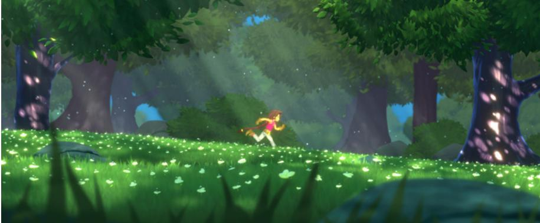

2D Lights in the *Lost Crypt* sample project

— **[Shader Graph](https://docs.unity3d.com/Packages/com.unity.render-pipelines.universal@7.1/manual/ShaderGraph.html?utm_source=demand-gen&utm_medium=pdf&utm_campaign=asset-links-gmg-choose-unity-for-multiplatform&utm_content=game-dev-field-guide-ebook)** includes Lit and Unlit Sprite Masternodes. These streamline the node input, so you can pass in the appropriate Sample Texture2D nodes in order to render in 2D.

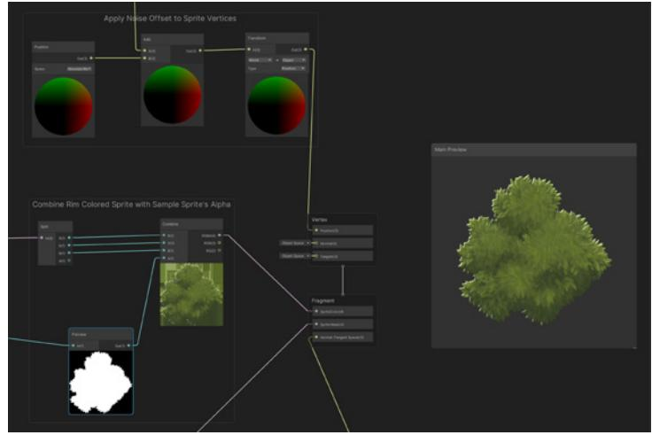

2D Shader Graph

— The **[2D Pixel Perfect package](https://docs.unity3d.com/Packages/com.unity.render-pipelines.universal@7.1/manual/2d-pixelperfect.html?utm_source=demand-gen&utm_medium=pdf&utm_campaign=asset-links-gmg-choose-unity-for-multiplatform&utm_content=game-dev-field-guide-ebook)** contains the Pixel Perfect Camera component, which ensures your pixel art remains crisp and clear at different resolutions, and stable in motion.

We recommend that you start with one of the available 2D demos, such as the *[Lost Crypt](https://assetstore.unity.com/packages/essentials/tutorial-projects/lost-crypt-2d-sample-project-158673?utm_source=demand-gen&utm_medium=pdf&utm_campaign=asset-links-gmg-choose-unity-for-multiplatform&utm_content=game-dev-field-guide-ebook)* and *[Dragon Crashers](https://assetstore.unity.com/packages/essentials/tutorial-projects/dragon-crashers-2d-sample-project-190721?utm_source=demand-gen&utm_medium=pdf&utm_campaign=asset-links-gmg-choose-unity-for-multiplatform&utm_content=game-dev-field-guide-ebook)* 2D sample projects. These should inspire you on how to assemble the 2D tools into a real-time experience.

## <span id="page-73-0"></span>**Worldbuilding**

Your games will need some levels. These tools can help.

#### <span id="page-73-1"></span>**ProBuilder and Polybrush**

Unity includes an add-on package called [ProBuilder,](https://docs.unity3d.com/Packages/com.unity.probuilder@5.0/manual/index.html?utm_source=demand-gen&utm_medium=pdf&utm_campaign=asset-links-gmg-choose-unity-for-multiplatform&utm_content=game-dev-field-guide-ebook) a streamlined 3D modeling and level design tool. Use ProBuilder to quickly prototype structures or to make custom collision geometry, trigger zones, or nav meshes. This is optimized for building simple geometry and greyboxing your game levels.

[Polybrush](https://docs.unity3d.com/Packages/com.unity.polybrush@1.1/manual/index.html?utm_source=demand-gen&utm_medium=pdf&utm_campaign=asset-links-gmg-choose-unity-for-multiplatform&utm_content=game-dev-field-guide-ebook) gives you the ability to sculpt meshes, blend textures, paint vertex colors, and scatter objects over your levels. Together with ProBuilder, you have a complete suite of tools for level design. Roundtrip with your DCC package of choice (Maya, Blender, etc.) to further refine your models.

#### <span id="page-73-2"></span>**Terrain tools**

For complex natural 3D environments, the Unity Editor includes a built-in set of [Terrain tools](https://docs.unity3d.com/Manual/terrain-Tools.html?utm_source=demand-gen&utm_medium=pdf&utm_campaign=asset-links-gmg-choose-unity-for-multiplatform&utm_content=game-dev-field-guide-ebook) (available as a package in Unity 2021.2 and above) that allow you to add landscapes to your game. In the Editor, you can create multiple Terrain tiles, adjust the height or appearance of your landscape using brush based tools, and add trees or grass to it.

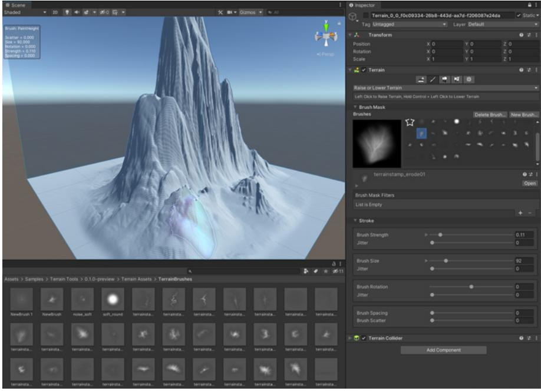

Unity Terrain tools

#### <span id="page-74-0"></span>**2D Tilemap and Sprite Shape**

Working in 2D? Create large grid-based worlds, including hexagonal and isometric environments, with [Tilemap](https://blog.unity.com/technology/isometric-2d-environments-with-tilemap?utm_source=demand-gen&utm_medium=pdf&utm_campaign=asset-links-gmg-choose-unity-for-multiplatform&utm_content=game-dev-field-guide-ebook). This system stores and handles [Tile Assets](https://docs.unity3d.com/Manual/Tilemap-TileAsset.html) for creating 2D levels. Then, you can set up a Tile Palette and use a variety of Brushes to paint your 2D Tilemaps.

[Sprite Shape](https://blog.unity.com/technology/intro-to-2d-world-building-with-sprite-shape?utm_source=demand-gen&utm_medium=pdf&utm_campaign=asset-links-gmg-choose-unity-for-multiplatform&utm_content=game-dev-field-guide-ebook) gives you the freedom to create rich free-form and organic 2D environments with a visual and intuitive workflow. The tool works by dynamically tiling sprites along spline paths based on a given set of angle ranges. Sprites tiling on the spline automatically deform, and the tool swaps sprites based on the outline angle.


The SpriteShape tool lets you create organic 2D environments.

### <span id="page-75-0"></span>**Unity Asset Store**

The Unity [Asset Store](https://assetstore.unity.com?utm_source=demand-gen&utm_medium=pdf&utm_campaign=asset-links-gmg-choose-unity-for-multiplatform&utm_content=game-dev-field-guide-ebook) offers a variety of assets, from textures, animations, and models to entire project examples, tutorials, and Editor extensions. Both Unity Technologies and members of the community create assets and publish them to this active marketplace. You can download asset packages directly into your Unity project with the Package Manager.

To access the Asset Store online, log into your Unity account, then shop a variety of 2D, 3D, and scripting assets:

- The **[Templates](https://assetstore.unity.com/categories/templates?utm_source=demand-gen&utm_medium=pdf&utm_campaign=asset-links-gmg-choose-unity-for-multiplatform&utm_content=game-dev-field-guide-ebook)** section enables you to download various tutorials and starter packs.
- **[Audio](https://assetstore.unity.com/categories/audio?utm_source=demand-gen&utm_medium=pdf&utm_campaign=asset-links-gmg-choose-unity-for-multiplatform&utm_content=game-dev-field-guide-ebook)** has a library of sound files that you can use to enrich the user experience of your project, including ambient, music, voice, and sound effects.
- The **[2D](https://assetstore.unity.com/2d?utm_source=demand-gen&utm_medium=pdf&utm_campaign=asset-links-gmg-choose-unity-for-multiplatform&utm_content=game-dev-field-guide-ebook)** and **[3D](https://assetstore.unity.com/3d?utm_source=demand-gen&utm_medium=pdf&utm_campaign=asset-links-gmg-choose-unity-for-multiplatform&utm_content=game-dev-field-guide-ebook)** sections feature plenty of environments, props, and characters in all art styles and genres to fill out your game levels.
- Browse for **[Tools and Editors](https://assetstore.unity.com/categories/tools?utm_source=demand-gen&utm_medium=pdf&utm_campaign=asset-links-gmg-choose-unity-for-multiplatform&utm_content=game-dev-field-guide-ebook)** if you're short on development time.
- Discover systems for enhanced functions, from [AI](https://assetstore.unity.com/categories/tools/ai?utm_source=demand-gen&utm_medium=pdf&utm_campaign=asset-links-gmg-choose-unity-for-multiplatform&utm_content=game-dev-field-guide-ebook) to [Visual Scripting](https://assetstore.unity.com/categories/tools/visual-scripting?utm_source=demand-gen&utm_medium=pdf&utm_campaign=asset-links-gmg-choose-unity-for-multiplatform&utm_content=game-dev-field-guide-ebook).

#### <span id="page-75-1"></span>**Importing an asset**

Once you purchase a free or paid asset, it should appear on your Unity account. In the Package Manager (**Window > Package Manager**), filter for **My Assets**, then download and import any assets associated with your account into the current project.

#### <span id="page-75-2"></span>**Become a publisher**

You can become a publisher on the Asset Store to sell your creations (3D models, Editor extensions, audio, and more) and add a new stream

of revenue while you're working on your game. To get started, create an [Asset Store](https://publisher.assetstore.unity3d.com/create.html?utm_source=demand-gen&utm_medium=pdf&utm_campaign=asset-links-gmg-choose-unity-for-multiplatform&utm_content=game-dev-field-guide-ebook)  [Publisher](https://publisher.assetstore.unity3d.com/create.html?utm_source=demand-gen&utm_medium=pdf&utm_campaign=asset-links-gmg-choose-unity-for-multiplatform&utm_content=game-dev-field-guide-ebook) account, check out the [Submission](https://assetstore.unity.com/publishing/submission-guidelines?utm_source=demand-gen&utm_medium=pdf&utm_campaign=asset-links-gmg-choose-unity-for-multiplatform&utm_content=game-dev-field-guide-ebook)  [Guidelines](https://assetstore.unity.com/publishing/submission-guidelines?utm_source=demand-gen&utm_medium=pdf&utm_campaign=asset-links-gmg-choose-unity-for-multiplatform&utm_content=game-dev-field-guide-ebook), and follow the [Asset Store Provider](https://unity3d.com/legal/as_provider?utm_source=demand-gen&utm_medium=pdf&utm_campaign=asset-links-gmg-choose-unity-for-multiplatform&utm_content=game-dev-field-guide-ebook)  [Agreement.](https://unity3d.com/legal/as_provider?utm_source=demand-gen&utm_medium=pdf&utm_campaign=asset-links-gmg-choose-unity-for-multiplatform&utm_content=game-dev-field-guide-ebook) Submit your content using the [Sell](https://unity3d.com/asset-store/sell-assets?utm_source=demand-gen&utm_medium=pdf&utm_campaign=asset-links-gmg-choose-unity-for-multiplatform&utm_content=game-dev-field-guide-ebook) 


[Assets](https://unity3d.com/asset-store/sell-assets?utm_source=demand-gen&utm_medium=pdf&utm_campaign=asset-links-gmg-choose-unity-for-multiplatform&utm_content=game-dev-field-guide-ebook) page. The Asset Store third-party asset marketplace

### <span id="page-76-0"></span>**Learning resources**

Take advantage of Unity's extensive documentation and learning resources to help you dive deeper into development.

#### <span id="page-76-1"></span>**Documentation**

The Unity [Manual](https://docs.unity3d.com/Manual/UnityManual.html?utm_source=demand-gen&utm_medium=pdf&utm_campaign=asset-links-gmg-choose-unity-for-multiplatform&utm_content=game-dev-field-guide-ebook) and [Scripting API](https://docs.unity3d.com/ScriptReference/index.html?utm_source=demand-gen&utm_medium=pdf&utm_campaign=asset-links-gmg-choose-unity-for-multiplatform&utm_content=game-dev-field-guide-ebook) are the most complete guides to Unity. The Manual documentation covers virtually every feature and tool, and we're constantly updating.

[Packages](https://docs.unity3d.com/2021.2/Documentation/Manual/upm-docs.html?utm_source=demand-gen&utm_medium=pdf&utm_campaign=asset-links-gmg-choose-unity-for-multiplatform&utm_content=game-dev-field-guide-ebook) have their own documentation microsites. You can always access the [latest version](https://docs.unity3d.com/2021.2/Documentation/Manual/upm-docs.html#Manual?utm_source=demand-gen&utm_medium=pdf&utm_campaign=asset-links-gmg-choose-unity-for-multiplatform&utm_content=game-dev-field-guide-ebook) from the Unity Manual or [access a specific package version's](https://docs.unity3d.com/2021.2/Documentation/Manual/upm-docs.html#Editor?utm_source=demand-gen&utm_medium=pdf&utm_campaign=asset-links-gmg-choose-unity-for-multiplatform&utm_content=game-dev-field-guide-ebook)  [documentation](https://docs.unity3d.com/2021.2/Documentation/Manual/upm-docs.html#Editor?utm_source=demand-gen&utm_medium=pdf&utm_campaign=asset-links-gmg-choose-unity-for-multiplatform&utm_content=game-dev-field-guide-ebook) using the Package Manager window.

#### <span id="page-76-2"></span>**Unity Learn**

Everyone has access to over 750 hours of free on-demand and live learning resources at [Unity Learn.](http://learn.unity.com?utm_source=demand-gen&utm_medium=pdf&utm_campaign=asset-links-gmg-choose-unity-for-multiplatform&utm_content=game-dev-field-guide-ebook) There, you can ask questions, get tips, and work through real-world projects with help from Unity experts and fellow creators.

#### <span id="page-76-3"></span>**Unity Blog**

The [Unity Blog](https://blog.unity.com?utm_source=demand-gen&utm_medium=pdf&utm_campaign=asset-links-gmg-choose-unity-for-multiplatform&utm_content=game-dev-field-guide-ebook) is a source for timely news, updates, and software releases, with short, readable articles covering everything from emergent technology to community events to intimate chats with Unity game creators. Whether you're an artist, programmer, technical artist, or designer, the blog offers tips and insights from the community to help you upskill.

#### <span id="page-76-4"></span>**Professional training**

[Unity Professional Training](https://unity.com/learn/professionals?utm_source=demand-gen&utm_medium=pdf&utm_campaign=asset-links-gmg-choose-unity-for-multiplatform&utm_content=game-dev-field-guide-ebook) now offers access to over 200 hours of training content with [On-Demand Training.](https://unity.com/products/on-demand-training?utm_source=demand-gen&utm_medium=pdf&utm_campaign=asset-links-gmg-choose-unity-for-multiplatform&utm_content=game-dev-field-guide-ebook) An annual subscription unlocks full access to curated courses, bite-sized video content, assessments, course challenges, and certificates.

Our experienced instructional designers created these materials in partnership with our engineers and product teams. This means that your team is always receiving the most up-to-date training on the latest Unity tech. See the [course catalog](https://protraining.unity.com/pages/15/professional-training-home?utm_source=demand-gen&utm_medium=pdf&utm_campaign=asset-links-gmg-choose-unity-for-multiplatform&utm_content=game-dev-field-guide-ebook) to get started. Unity Professional Training


### <span id="page-77-0"></span>**Next steps**

We hope this guide is useful in your discovery of how Unity can help you reach your creative destination. Don't forget that getting there is half the fun.

Unity offers [tools and services](https://unity.com/solutions/game?utm_source=demand-gen&utm_medium=pdf&utm_campaign=asset-links-gmg-choose-unity-for-multiplatform&utm_content=creating-subnautica-case-study) to make sure you are supported throughout your game development journey, from big idea to big success. If you're ready to dive in deeper, you can [get started with Unity Pro today](https://store.unity.com/products/unity-pro?utm_source=demand-gen&utm_medium=pdf&utm_campaign=asset-links-gmg-choose-unity-for-multiplatform&utm_content=creating-subnautica-case-study) or [talk to one of our experts](https://create.unity3d.com/lets-talk-games?utm_source=demand-gen&utm_medium=pdf&utm_campaign=asset-links-gmg-choose-unity-for-multiplatform&utm_content=creating-subnautica-case-study) to learn how we can assist you.

© 2021 Unity Technologies **78 of 79** | unity[.com](https://unity.com/)


[unity.com](https://unity.com/)